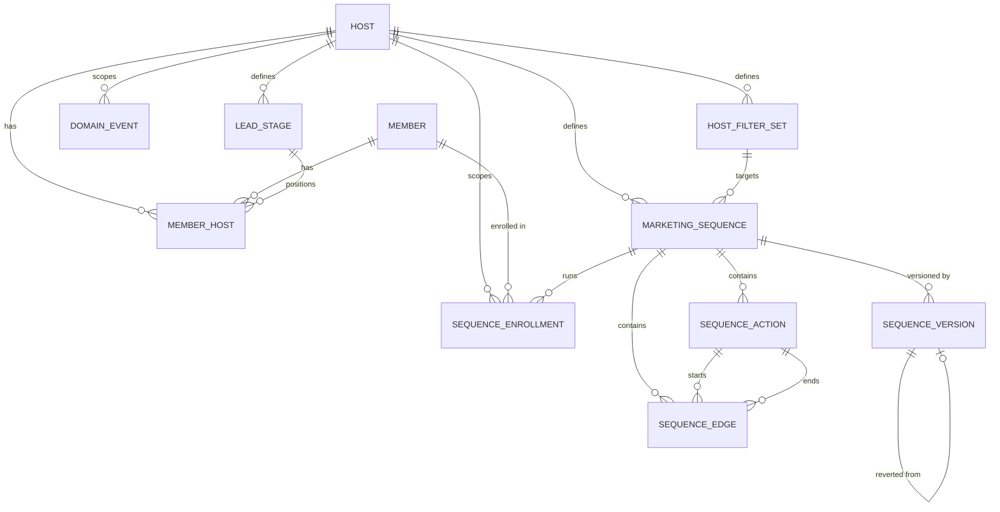

# Data model

First vertical-slice domain: a `Host` (tenant/customer) has `Member`s spanning a
spectrum from lead to fully enrolled, and can define marketing sequences that
automatically act on members over time.

This model is deliberately lean for a PoC. It's informed by the equivalent
domain in Momence's production system (`work/monorepo/view/backend`), adopting
patterns that have proven themselves there while intentionally simplifying or
deferring parts that aren't needed yet. See [Comparison to legacy](#comparison-to-legacy-momence)
below.

## Entities

### Host

The tenant boundary - every tenant-scoped table carries a `hostId` column
directly (no separate abstract "tenant" concept).

| Field          | Type      | Notes                                                                                                                                                                                      |
| -------------- | --------- | ------------------------------------------------------------------------------------------------------------------------------------------------------------------------------------------ |
| `id`           | uuid      | client-generated (see [Why client-generated UUID ids](#why-client-generated-uuid-ids))                                                                                                     |
| `name`         | string    |                                                                                                                                                                                            |
| `slug`         | string    | unique, used as subdomain/URL identifier                                                                                                                                                   |
| `email`        | string    |                                                                                                                                                                                            |
| `timeZone`     | string    |                                                                                                                                                                                            |
| `currency`     | string    |                                                                                                                                                                                            |
| `businessType` | string    | required - e.g. `"gym"`, `"yoga_studio"`, `"martial_arts"`, `"spa"` (extensible, same pattern as `triggerType`); drives `LeadStage` seeding, see [`LeadStageTemplate`](#leadstagetemplate) |
| `createdAt`    | timestamp |                                                                                                                                                                                            |

### Member

A person's global identity, independent of any host. One `Member` can be
associated with multiple hosts (see [`MemberHost`](#memberhost)) - e.g. the
same person can be a member at two different studios.

| Field         | Type           | Notes |
| ------------- | -------------- | ----- |
| `id`          | uuid           |       |
| `email`       | string         |       |
| `firstName`   | string \| null |       |
| `lastName`    | string \| null |       |
| `phoneNumber` | string \| null |       |
| `createdAt`   | timestamp      |       |

### MemberHost

The junction between a `Member` and a `Host` - this is where the lead ↔
enrolled spectrum actually lives, because it's a property of the
_relationship_ between a person and a specific host, not of the person
globally. The same `Member` can be `enrolled` at one host and a `lead` at
another simultaneously.

| Field         | Type                          | Notes                                                                                                                                                                                                                                                                                  |
| ------------- | ----------------------------- | -------------------------------------------------------------------------------------------------------------------------------------------------------------------------------------------------------------------------------------------------------------------------------------- |
| `id`          | uuid                          | own primary key (not a composite key - see [Why client-generated UUID ids](#why-client-generated-uuid-ids))                                                                                                                                                                            |
| `memberId`    | uuid (FK → Member)            |                                                                                                                                                                                                                                                                                        |
| `hostId`      | uuid (FK → Host)              |                                                                                                                                                                                                                                                                                        |
| `status`      | `"lead" \| "enrolled"`        |                                                                                                                                                                                                                                                                                        |
| `convertedAt` | timestamp \| null             | when `status` most recently transitioned to `"enrolled"`. Captures the _latest_ transition only - if a member could ever flip `enrolled → lead → enrolled` and the full transition history mattered, that would need to come from `DomainEvent` instead. Decided against that for now. |
| `leadStageId` | uuid \| null (FK → LeadStage) | CRM pipeline position while `status` is `"lead"`. Independent of `status`: `status` is the binary "converted yet or not", `leadStageId` is "how far along the funnel" - the same split legacy makes between `CustomerLeads.stageId` and `convertedToCustomerAt`.                       |
| `createdAt`   | timestamp                     |                                                                                                                                                                                                                                                                                        |

Unique constraint on `(memberId, hostId)`.

### LeadStageTemplate

Platform-maintained reference data, not tenant-editable - the default set of
CRM pipeline stages for a given `businessType`. Different business types need
meaningfully different default funnels (a gym's lead process looks nothing
like a spa's), so this isn't one fixed list.

| Field          | Type           | Notes                       |
| -------------- | -------------- | --------------------------- |
| `id`           | uuid           |                             |
| `businessType` | string         | matches `Host.businessType` |
| `name`         | string         |                             |
| `color`        | string \| null |                             |
| `order`        | number         |                             |

### LeadStage

A host's actual, editable CRM pipeline stages - seeded (copied, not
live-referenced) from the matching `LeadStageTemplate` rows when the host is
created, then fully owned by the host from that point on. Renaming, reordering,
recoloring, adding, or removing a host's stages never touches
`LeadStageTemplate` or any other host.

| Field       | Type             | Notes |
| ----------- | ---------------- | ----- |
| `id`        | uuid             |       |
| `hostId`    | uuid (FK → Host) |       |
| `name`      | string           |       |
| `color`     | string \| null   |       |
| `order`     | number           |       |
| `createdAt` | timestamp        |       |

### MarketingSequence

A host-defined automation: on a trigger, run a sequence of actions against
enrolled/lead members.

| Field         | Type                              | Notes                                                                                                                                         |
| ------------- | --------------------------------- | --------------------------------------------------------------------------------------------------------------------------------------------- |
| `id`          | uuid                              |                                                                                                                                               |
| `hostId`      | uuid (FK → Host)                  |                                                                                                                                               |
| `name`        | string                            |                                                                                                                                               |
| `triggerType` | string                            | validated against a growing Schema union in code, not a native DB enum or lookup table - adding a new trigger type never requires a migration |
| `filterSetId` | uuid \| null (FK → HostFilterSet) | who this sequence targets beyond "the trigger fired" - `null` means everyone the trigger fires for                                            |
| `isEnabled`   | boolean                           |                                                                                                                                               |
| `createdAt`   | timestamp                         |                                                                                                                                               |

### HostFilterSet

A named, reusable set of targeting rules for a host - replaces having one
one-off nullable FK column per targeting dimension on `MarketingSequence`
(the kind of thing legacy started with and later refactored away from - see
[Comparison to legacy](#comparison-to-legacy-momence)).

| Field       | Type             | Notes                           |
| ----------- | ---------------- | ------------------------------- |
| `id`        | uuid             |                                 |
| `hostId`    | uuid (FK → Host) |                                 |
| `name`      | string           |                                 |
| `rules`     | jsonb            | a `FilterRule` tree - see below |
| `createdAt` | timestamp        |                                 |

`rules` is a recursive expression tree, not normalized rule rows - boolean
`AND`/`OR`/`NOT` nesting maps awkwardly onto relational rows, and legacy
itself stores its equivalent (`counterConditions`) as jsonb rather than a rule
table:

```
FilterRule =
  | { type: "condition", field: string, operator: FilterOperator, value: unknown }
  | { type: "group", combinator: "and" | "or", rules: FilterRule[] }

FilterOperator =
  | "equals" | "not_equals" | "contains"
  | "gt" | "gte" | "lt" | "lte"
  | "in" | "not_in"
```

`field` is an extensible string (grows the same way as `triggerType` and
`SequenceAction.type`, no migration needed to add a new targetable field).
`operator` is a fixed union - comparison operators are stable enough not to
need the same growability.

### SequenceAction

One node in a sequence's action graph.

| Field           | Type                                                           | Notes                                                                                                                                                            |
| --------------- | -------------------------------------------------------------- | ---------------------------------------------------------------------------------------------------------------------------------------------------------------- |
| `id`            | uuid                                                           | client-generated - stable across a `SequenceVersion` revert                                                                                                      |
| `sequenceId`    | uuid (FK → MarketingSequence)                                  |                                                                                                                                                                  |
| `type`          | `"EMAIL" \| "SMS" \| "CONDITION" \| "TAG_ADD" \| "TAG_REMOVE"` | small starter set; extensible the same way as `triggerType`                                                                                                      |
| `offsetMinutes` | number                                                         | **absolute** offset from the trigger time, not relative to the previous action - avoids compounding drift and simplifies reordering actions in a flow-builder UI |
| `config`        | jsonb                                                          | shape depends on `type` (e.g. template/subject for `EMAIL`, tag id for `TAG_ADD`)                                                                                |

### SequenceEdge

The DAG structure between actions - explicit adjacency, not a `nextActionId`
pointer on the action itself. This is what lets a `CONDITION` action branch.

| Field             | Type                          | Notes                                                                                         |
| ----------------- | ----------------------------- | --------------------------------------------------------------------------------------------- |
| `id`              | uuid                          |                                                                                               |
| `sequenceId`      | uuid (FK → MarketingSequence) |                                                                                               |
| `fromActionId`    | uuid (FK → SequenceAction)    |                                                                                               |
| `toActionId`      | uuid (FK → SequenceAction)    |                                                                                               |
| `conditionBranch` | `"true" \| "false" \| null`   | `null` = unconditional edge; otherwise which branch of a `CONDITION` action this edge follows |

### SequenceEnrollment

One run of a sequence for one member - i.e. the enrollment record.

| Field         | Type                          | Notes                            |
| ------------- | ----------------------------- | -------------------------------- |
| `id`          | uuid                          |                                  |
| `hostId`      | uuid (FK → Host)              | denormalized, for tenant scoping |
| `sequenceId`  | uuid (FK → MarketingSequence) |                                  |
| `memberId`    | uuid (FK → Member)            |                                  |
| `triggeredAt` | timestamp                     |                                  |
| `finishedAt`  | timestamp \| null             |                                  |
| `cancelledAt` | timestamp \| null             |                                  |

Lifecycle is expressed via these nullable timestamps, not a status enum.
"Current position in the sequence" is not persisted as authoritative state -
it's recomputed from `SequenceAction`/`SequenceEdge` plus these timestamps
whenever the enrollment is advanced, which keeps it tolerant of the sequence
definition changing mid-flight.

### SequenceVersion

A full snapshot of a sequence's definition at a point in time, enabling undo /
revert-to-a-point-in-history (not full event sourcing - see
[Why snapshots, not event sourcing](#why-snapshots-not-event-sourcing)).

| Field                   | Type                                    | Notes                                                                                |
| ----------------------- | --------------------------------------- | ------------------------------------------------------------------------------------ |
| `id`                    | uuid                                    |                                                                                      |
| `sequenceId`            | uuid (FK → MarketingSequence)           |                                                                                      |
| `hostId`                | uuid (FK → Host)                        |                                                                                      |
| `snapshot`              | jsonb                                   | full definition at this point: name, triggerType, isEnabled, actions, edges          |
| `revertedFromVersionId` | uuid \| null (FK → SequenceVersion)     | set when this version was created _as the result of_ reverting to an earlier version |
| `actorType`             | `"host_user" \| "ai_agent" \| "system"` |                                                                                      |
| `actorId`               | uuid \| null                            |                                                                                      |
| `createdAt`             | timestamp                               |                                                                                      |

Reverting means restoring the live `SequenceAction`/`SequenceEdge` rows from
`snapshot` **using the original ids captured in the snapshot** (an upsert
keyed by `id`, not a wipe-and-regenerate-fresh-ids operation) - see
[Why client-generated UUID ids](#why-client-generated-uuid-ids) for why that's
safe. Reverting also writes a _new_ `SequenceVersion` row (with
`revertedFromVersionId` set) rather than just mutating history in place.

### DomainEvent

A generic, append-only audit trail spanning every aggregate in the system -
not per-aggregate audit tables.

| Field           | Type                                    | Notes                                                                                     |
| --------------- | --------------------------------------- | ----------------------------------------------------------------------------------------- |
| `id`            | uuid                                    |                                                                                           |
| `hostId`        | uuid (FK → Host)                        |                                                                                           |
| `aggregateType` | string                                  | e.g. `"Member"`, `"MemberHost"`, `"MarketingSequence"`, `"SequenceEnrollment"`            |
| `aggregateId`   | uuid                                    | polymorphic - references whichever aggregate `aggregateType` names, not a single fixed FK |
| `eventType`     | string                                  | e.g. `"MemberEnrolled"`, `"SequenceActionExecuted"`, `"SequenceReverted"`                 |
| `payload`       | jsonb                                   | shape depends on `eventType`                                                              |
| `actorType`     | `"host_user" \| "ai_agent" \| "system"` | who/what caused this - important for auditing AI-agent-triggered mutations                |
| `actorId`       | uuid \| null                            |                                                                                           |
| `occurredAt`    | timestamp                               |                                                                                           |

`payload` also covers detailed per-action execution results (legacy's
`HostCampaignSequenceRunLogs` + a separate polymorphic result table per action
type) - no extra tables needed, just a per-`eventType` payload shape, the same
pattern `SequenceAction.config` already uses for `type`:

```
eventType: "SequenceActionExecuted"
aggregateType: "SequenceEnrollment"
aggregateId: <enrollmentId>
payload: {
  actionId: uuid
  actionType: "EMAIL" | "SMS" | "CONDITION" | "TAG_ADD" | "TAG_REMOVE"
  result:
    // discriminated union depending on actionType
    | { actionType: "EMAIL" | "SMS", messageId: string, sentAt: timestamp, provider: string }
    | { actionType: "CONDITION", branchTaken: "true" | "false" }
    | { actionType: "TAG_ADD" | "TAG_REMOVE", tagId: uuid }
}
```

## Relationships



## Design decisions

### Why client-generated UUID ids

Every synced table uses a single `id: uuid` primary key generated on the
client, never a database auto-increment integer. This is a hard requirement
from PowerSync (every synced table needs a single `text`-typed primary key
column named `id`, recommended as a client-generated UUID) so that the client
can write optimistically to its local replica before the server confirms
anything - not a stylistic choice.

It also happens to solve stable identity across a `SequenceVersion` revert for
free: restoring a snapshot re-creates rows with their _original_ ids rather
than minting new ones, so anything that referenced an action by id (edges,
idempotency checks when the action actually runs) keeps working across a
revert with no extra "stable key" field needed.

### Why snapshots, not event sourcing

`DomainEvent` records _what happened_, but reconstructing "the full state of a
sequence at time T" by replaying deltas is full event sourcing - which adds
real friction against PowerSync's sync-based architecture (state would need to
exist only as a projection, complicating what actually gets synced). Momence's
own sequence-run engine doesn't do this either: `finishedAt`/`cancelledAt` are
plain columns, not derived by replay.

For the one thing that genuinely needs point-in-time revert (a sequence's
definition), a full-state snapshot per version is simpler than event replay:
revert is "restore this snapshot," not "replay N deltas against a blank
state."

### Why status lives on `MemberHost`, not `Member`

Enrollment status is a property of the relationship between a person and a
specific host, not of the person globally - the same `Member` can be
`enrolled` at one host and a `lead` at another at the same time.

### Why one generic `DomainEvent`, not per-aggregate audit tables

Momence's own system grew three overlapping "customer state machine" concepts
over time (lead pipeline stages, member journeys, campaign sequence runs) that
its own codebase flags as organic growth rather than intentional design. A
single generic event log across all aggregates avoids repeating that.

## Comparison to legacy (Momence)

Legacy reference: `work/monorepo/view/backend/db/entities/` (`Hosts`,
`RibbonMembers`, `RibbonMembersHosts`, `CustomerLeads`,
`HostCampaignSequence*`).

| Aspect                          | Legacy                                                                                                                               | This model                                                                                                                                                       |
| ------------------------------- | ------------------------------------------------------------------------------------------------------------------------------------ | ---------------------------------------------------------------------------------------------------------------------------------------------------------------- |
| Member identity                 | 4 tables (`RibbonMembers` + `RibbonMembersHosts` + `CustomerLeads` with its own id space + `UserRegistrationRequests` capture layer) | 2 tables (`Member` + `MemberHost` with `status` directly on the junction)                                                                                        |
| Status                          | none - inferred from row presence/absence and timestamps (`convertedToCustomerAt`, existence of a `BoughtMemberships` row)           | explicit `status: "lead" \| "enrolled"`                                                                                                                          |
| Trigger types                   | DB lookup table with per-trigger capability flags (`enabledForEmails`, `pickSession`, ...), 48 values                                | plain extensible string, no capability-flag metadata, fewer starter values                                                                                       |
| Action types                    | 14 values (incl. `WHATSAPP`, `HOST_TASK`, `MONEY_CREDITS_ADD`, `MEMBERSHIP_ADD`)                                                     | 5 starter values (`EMAIL`, `SMS`, `CONDITION`, `TAG_ADD`, `TAG_REMOVE`)                                                                                          |
| Action offset                   | 3 columns (`offsetDays`/`offsetHours`/`offsetMinutes`)                                                                               | 1 column (`offsetMinutes`), same absolute-from-trigger principle                                                                                                 |
| DAG structure                   | separate edges table (`start_action_id`/`end_action_id`/`condition_branch_type`)                                                     | adopted ~1:1 (`SequenceEdge`)                                                                                                                                    |
| Audit/history                   | split across `HostCampaignSequenceRunLogs` (sequence-run-specific) + per-action-type polymorphic result tables                       | one generic `DomainEvent` across all aggregates, incl. per-action execution results via `payload`                                                                |
| Sequence definition undo/revert | not found in legacy                                                                                                                  | `SequenceVersion` (net-new)                                                                                                                                      |
| AI-agent actor tracking         | not applicable (no AI-agent concept)                                                                                                 | `actorType`/`actorId` on `DomainEvent` and `SequenceVersion` (net-new)                                                                                           |
| Sequence targeting              | one `hostFilterSetId` FK + jsonb `counterConditions` (after refactoring away from ~15 one-off FK columns)                            | `HostFilterSet` + jsonb `rules` tree (adopted ~1:1)                                                                                                              |
| Lead pipeline stages            | `CustomerLeadsStages` - per-host only, freely defined from a blank slate, no business-type templating found                          | `LeadStageTemplate` (per `businessType`, platform-maintained) seeds `LeadStage` (per-host, then freely editable) - net-new templating layer, not found in legacy |
| Host entity                     | ~250-relation aggregate covering billing, scheduling, messaging, integrations, etc.                                                  | lean (7 fields); everything else added iteratively as separate concerns                                                                                          |

### Effect Schema → Drizzle bridge

Built as `packages/db`: hand-written Drizzle table definitions (Postgres, via
`drizzle-orm`/`drizzle-kit`) alongside the Effect Schema entities in
`packages/schema`, plus a drift test (`packages/db/src/drift.test.ts`) that
compares each Drizzle table's column-name set against its corresponding Effect
Schema's field-name set, failing if they diverge.

Rejected alternative: codegen instead of a drift test. Drizzle does ship an
Effect Schema bridge (`drizzle-orm/effect-schema`'s `createInsertSchema`/
`createUpdateSchema`/`createSelectSchema`, generating Effect Schema validators
from a Drizzle table - genuinely targets Effect v4, not a stale v3 tool), but
two things rule it out here: it only exists on Drizzle's `1.0.0-rc.*` line, not
the `0.45.x` stable release this repo pins, and it generates in the opposite
direction from what we need - DB table to per-operation validator, not our
domain-model-is-the-source-of-truth direction. It also wouldn't replace
`packages/schema`'s branded ids or discriminated unions (`SequenceAction`,
`FilterRule`), only auto-derive raw CRUD-shaped validators from the DB row
shape. Worth revisiting once Drizzle v1 is stable, as a way to generate
`apps/server`'s raw insert/update/select validators - not as a replacement for
this drift test or for `packages/schema` itself.

`id`/foreign-key columns are `text`, not Postgres's native `uuid` type - same
PowerSync requirement as the `id` column itself (see "Why client-generated UUID
ids" above). `SequenceAction` is one flat table in Postgres even though
`packages/schema` models it as a discriminated union in TypeScript - `config`'s
shape depends on `type` at the application layer, not the DB layer, so the
drift test reads its field set from any one of the union's cases (they all
share the same top-level keys).

### Postgres RLS for multi-tenancy

Every host-scoped table in `packages/db`'s schema has `.enableRLS()` plus a
`pgPolicy` (see `packages/db/src/rls.ts` for the two shared policy builders):

- **Direct `host_id` column** (`hosts` itself via `id`, `host_filter_sets`,
  `lead_stages`, `marketing_sequences`, `member_hosts`, `sequence_enrollments`,
  `sequence_versions`, `domain_events`) - `hostIsolationPolicy(column)`, a
  simple `column = current_setting('app.host_id', true)` check.
- **Scoped only via a join** (`members` via `member_hosts`,
  `sequence_actions`/`sequence_edges` via `marketing_sequences`) -
  `hostIsolationViaJoinPolicy(...)`, an `exists (select 1 from <join table>
where ...)` check. References the other table by literal SQL name rather
  than importing its Drizzle table object, to avoid circular imports between
  schema files (e.g. `MemberHost.ts` already imports `members`).
- **`lead_stage_templates` deliberately has no RLS** - it's platform-maintained
  reference data, not scoped to any host.

Every policy uses `for: "all"` with the same expression in both `using` and
`withCheck`, so it applies uniformly to reads and writes.

**The session variable a policy checks must actually get set, and the
connecting role must actually be subject to RLS** - two gaps that would make
enabling RLS pure theater if left unaddressed:

- Postgres lets the table **owner** bypass RLS by default (`FORCE ROW LEVEL
SECURITY` would override this, but this repo takes the other approach:
  `postgres/init-scripts/02-app-user-role.sql` creates a separate non-owner,
  non-superuser `app_user` role with `SELECT`/`INSERT`/`UPDATE`/`DELETE`
  grants only. `effective_app` (the `DATABASE_URL` role) still owns every
  table via drizzle-kit migrations and bypasses RLS entirely - it must never
  be used for request-time queries. `apps/server` connects via a separate
  `APP_DATABASE_URL`, as `app_user`.
- `apps/server/src/HostScopedDb.ts` is the only way `apps/server`'s handlers
  touch the database: `query(fn)` opens a Drizzle transaction, runs
  `select set_config('app.host_id', $1, true)` (parameterized, transaction-
  local) using the current request's verified `CurrentHost.hostId`, then runs
  `fn` inside that same transaction. There's no other entry point to
  `Db` exposed to handlers, so a handler can't accidentally issue a
  host-scoped query without that context set.

**Verified end-to-end** (2026-07-16): as the `app_user` role directly via
`psql`, with two seeded hosts, `set_config('app.host_id', '<host A>', true)`
returns only host A's row (and only host A's `members`, via the join policy),
switching to host B's id returns only host B's, and with no `app.host_id` set
at all the query returns zero rows (fail-closed, not fail-open). The same
proof was repeated one level up, through `apps/server`'s real `GET /hosts/me`
endpoint (see "Auth: Keycloak + apps/server" below) - a password-grant token
for the seeded test user returns exactly that user's own host row, with no
`WHERE` clause needed in the handler at all; RLS is what's actually filtering.

### Auth: Keycloak + apps/server

Self-hosted Keycloak (`docker-compose.yml`'s `keycloak` service, dev-mode
`start-dev --import-realm`) is the identity provider; `apps/server` never
talks to it directly - business logic depends only on `AuthService`
(`apps/server/src/JwtVerifier.ts`/`Auth.ts`), a swappable `Layer` per
`AGENTS.md`'s auth rule, so Keycloak could be swapped for another OIDC
provider without touching domain code. Realm/client/test-user config lives in
`keycloak/realm-export.json`, imported automatically on first start - no
manual admin-console clicking needed to reproduce this setup.

`host_id` reaches the JWT via a Keycloak user-attribute protocol mapper
(`oidc-usermodel-attribute-mapper`) mapping the user's `host_id` attribute to
a `host_id` claim. Two gotchas hit while wiring this up, both easy to hit
again if this config is hand-edited later:

- **Keycloak 24+ ignores custom user attributes by default** ("unmanaged
  attributes" are disabled unless the realm's declarative user profile
  explicitly declares them) - `host_id` had to be added to the realm's user
  profile config (`components` → `org.keycloak.userprofile.UserProfileProvider`
  in `keycloak/realm-export.json`) before the attribute would even persist on
  import, let alone reach a token.
- **The mapper's config key is `user.attribute`, not `userAttribute`** -
  the latter is what the analogous OID4VC mapper uses, easy to confuse, and
  Keycloak silently accepts the wrong key (no validation error) while just
  never populating the claim. Confirmed the correct key via the running
  instance's own `/admin/serverinfo` endpoint, which lists every protocol
  mapper's real config property names.

A second mapper (`oidc-audience-mapper`, `included.custom.audience:
powersync-dev`) adds `powersync-dev` to the token's `aud` claim - this is
what lets the exact same Keycloak-issued token satisfy both `apps/server`'s
`AuthService` and PowerSync's `client_auth` (see below), rather than needing
two different tokens for the two consumers.

`apps/server` (`effect/unstable/httpapi`) has a public `/health` endpoint, a
protected `/me` endpoint, and a protected `/hosts/me` endpoint (which actually
queries Postgres through `HostScopedDb` - see "Postgres RLS for
multi-tenancy" above) - all behind an `Auth` `HttpApiMiddleware.Service` using
`HttpApiSecurity.bearer` - which only extracts the raw credential, the actual
verification is `JwtVerifier`, backed by `jose`'s `createRemoteJWKSet` against
Keycloak's realm JWKS endpoint. `JwtVerifier` is itself swappable (`layer` for
the real remote JWKS, `layerWithJwks` for tests using an in-memory JWK set),
so `AuthService.test.ts`-style unit tests never make a real network call, per
`AGENTS.md`'s "external I/O goes through swappable services" rule.

**Verified end-to-end** (2026-07-16): a password-grant token from Keycloak's
test user (`test-host-owner`, `host_id` attribute set to a fixed test UUID)
correctly returns `401` from `/me` with no token, and with the token returns
`200` with the exact `hostId`/`subject` from the JWT claims. The identical
token was then POSTed to PowerSync's `/sync/stream` and accepted, with the
returned checkpoint's `host_data` bucket correctly scoped to that same
`host_id` - confirming the audience mapper and `client_auth.jwks_uri` wiring
in `powersync/service.yaml` (see below) actually works against a real token,
not just against the hand-signed HS256 dev tokens used before Keycloak existed.

A non-obvious Effect `HttpApi` gotcha hit while wiring `/hosts/me`'s
`HostScopedDb` dependency, worth knowing before adding another per-handler
service dependency: a handler's own service requirements (as opposed to ones
a group's `.middleware(...)` already provides, like `CurrentHost`) surface on
`HttpApiBuilder.group(...)`'s layer as a specially-branded
`HttpRouter.Request<"Requires", _>` type, not the plain service tag. Providing
a normal `Layer.provide(HostScopedDbLayer)` _before_ `HttpRouter.serve` in
`main.ts`'s pipe silently fails to satisfy it (they're structurally different
types, so it just stays unresolved) - it only collapses to the plain tag
_after_ `HttpRouter.serve` runs, which is where `HostScopedDbLayer` actually
needs to be provided (see `main.ts`).

### PowerSync sync streams

Self-hosted PowerSync (not PowerSync Cloud - consistent with this repo's "no
cloud account needed for local dev" approach) runs via `docker-compose.yml`'s
`powersync`/`pg-storage` services, config in `powersync/service.yaml` and
`powersync/sync-config.yaml`. Scaffolded with the official `powersync` CLI
(`npx powersync init self-hosted` + `powersync docker configure --database
postgres --storage postgres`) rather than hand-assembled, to match the
tool's own tested defaults - notably, PowerSync's bucket/checkpoint metadata
store (`pg-storage`) is a **separate** Postgres instance from the replication
source (the existing `postgres` service, i.e. our actual app data), not a
schema on the same one.

Sync rules are written as **Sync Streams** (`config: { edition: 3 }` in
`sync-config.yaml`), not the legacy `bucket_definitions` format - Streams are
PowerSync's current recommended approach for new projects, and their expanded
SQL support (real `JOIN`s) is what lets `host_data`'s queries reach `members`
(via `member_hosts`) and `sequence_actions`/`sequence_edges` (via
`marketing_sequences`) without denormalizing `hostId` onto those tables just
for sync purposes.

The `postgres` service's `powersync` publication
(`postgres/init-scripts/01-powersync-publication.sql`) is `FOR ALL TABLES`,
created by `effective_app` (table ownership is required for `CREATE
PUBLICATION`). The **replication connection** itself, though, uses a separate
least-privilege `powersync_replication` role
(`postgres/init-scripts/03-powersync-replication-role.sql`) - `REPLICATION` +
read-only grants, never the `effective_app` superuser. Verified end-to-end
(2026-07-16): after switching `PS_DATA_SOURCE_URI` to this role and
recreating the `powersync` container, it reattached to the existing
replication slot ("Initial replication already done") and a subsequent
`INSERT INTO hosts` still replicated within seconds, confirming `SELECT`-only
access is sufficient for ongoing logical replication.

**Verified working** (2026-07-16, against a real local Docker stack - the
sandbox this was originally built in had Docker Hub pulls blocked, but the
setup was later confirmed on a real machine): `pnpm run dev:infra` brings up
all four services healthy, the `powersync` publication is created, an
`INSERT INTO hosts` shows up in `docker logs` within milliseconds as
`Replicating "public"."hosts" ...` / `Flushed 1 + 0 + 1 updates`. Two real
bugs were caught and fixed in the process, both worth knowing about since
they'll resurface on a fresh machine otherwise:

- **`postgres:18+`'s data directory layout changed** - the image now expects
  its volume mounted at `/var/lib/postgresql` (a parent directory it manages
  itself), not `/var/lib/postgresql/data` directly (the old convention);
  mounting at the old path made `postgres` fail its healthcheck outright on
  a fresh init. Fixed in `docker-compose.yml`'s `postgres` and `pg-storage`
  volume mounts. An existing volume created before this fix has data laid
  out for the old path and needs to be reinitialized once: `pnpm run
dev:infra:down && docker volume rm effective-app_postgres-data
effective-app_powersync-storage-data`.
- **`sslmode` defaults to `verify-full`** on PowerSync's Postgres connections
  (both `replication.connections` and `storage`) - our local Postgres
  containers have no TLS configured, so the client's SSL negotiation was
  failing the connection outright. Surfaced as a generic, unhelpful `"Fatal
startup error ... postgres query failed"` at the wire-protocol level (not a
  SQL error - confirmed by extracting and running the exact failing query,
  `CREATE TABLE IF NOT EXISTS locks (...)`, directly via `psql`, which
  succeeded fine). Fixed by adding `sslmode: disable` to both connections in
  `powersync/service.yaml` - local/private-network only, per PowerSync's own
  docs on that setting.

#### Verifying this works

1. **Apply the Drizzle migration first.** `sync-config.yaml` references real
   table names (`hosts`, `member_hosts`, ...) - they need to exist in Postgres
   before PowerSync can replicate them, so run `packages/db`'s
   `db:generate`/`db:migrate` (see "Effect Schema → Drizzle bridge" above)
   before starting PowerSync for the first time.
2. **Start the stack and check health.**
   ```sh
   pnpm run dev:infra
   docker compose ps                    # postgres, pg-storage, powersync all healthy
   docker compose logs powersync        # look for replication/connection errors
   docker exec -it effective-app-postgres-1 \
     psql -U effective_app -c "select * from pg_publication;"  # expect a `powersync` row
   ```
3. **Insert a row and watch it replicate** - the fastest concrete proof,
   no client SDK needed:
   ```sh
   docker exec -it effective-app-postgres-1 psql -U effective_app -d effective_app -c "
     INSERT INTO hosts (id, name, slug, email, time_zone, currency, business_type, created_at)
     VALUES ('11111111-1111-4111-8111-111111111111', 'Test', 'test', 'a@b.test', 'UTC', 'USD', 'gym', now());
   "
   docker compose logs powersync --tail 10  # expect "Replicating \"public\".\"hosts\" ..."
   ```
4. **Get a real token from Keycloak** for the seeded test user (see "Auth:
   Keycloak + apps/server" above) via the password grant:
   ```sh
   curl -X POST http://localhost:${KEYCLOAK_PORT:-8180}/realms/effective-app/protocol/openid-connect/token \
     -d "grant_type=password" -d "client_id=effective-app-client" \
     -d "username=test-host-owner" -d "password=local_dev_only"
   ```
   The `access_token` in the response carries both the `host_id` claim and the
   `powersync-dev` audience - the same token works against both `apps/server`
   and PowerSync below.
5. **Confirm `apps/server` accepts it**:
   ```sh
   curl http://localhost:4000/me                                   # 401, no token
   curl -H "Authorization: Bearer <access_token>" http://localhost:4000/me
   # 200 {"hostId":"<the test user's host_id attribute>","subject":"<sub>"}
   ```
6. **Confirm PowerSync accepts the same token**, scoped to that `host_id`:
   ```sh
   curl -X POST http://localhost:8080/sync/stream \
     -H "Authorization: Bearer <access_token>" -H "Content-Type: application/json" \
     -d '{"include_checksum": true}'
   # the host_data bucket's key includes the token's host_id, e.g.:
   # "bucket":"1#host_data|0[\"<host_id>\"]"
   ```
7. **The full end-to-end proof** - a real client syncing to local SQLite and
   seeing row changes - needed the client SDK wired into `apps/client`; done as
   a follow-on task, see "apps/client: Keycloak login + PowerSync client"
   below.

### apps/client: Keycloak login + PowerSync client

Closes the loop from the previous sections: a real browser login against
Keycloak, and a real PowerSync client syncing to local SQLite with writes
flowing back through a new `apps/server` endpoint to Postgres.

**Auth** (`apps/client/src/lib/auth.ts`): `oidc-client-ts`'s `UserManager`,
Authorization Code + PKCE against the same `effective-app-client` Keycloak
client `apps/server` uses for password-grant testing (`standardFlowEnabled`,
public client - PKCE is automatic since no `client_secret` is configured).
Token storage is in-memory only (`InMemoryWebStorage`), never
`sessionStorage`/`localStorage` - the OWASP-recommended pattern for SPAs, so
an XSS payload can't exfiltrate a token from storage after the fact. The
tradeoff is that a hard page reload loses the in-memory session;
`silent-renew.html` (a second Vite HTML entry point, not a route - see
`vite.config.ts`'s `build.rollupOptions.input`) recovers it via a hidden
iframe (`signinSilent()`, `prompt=none`) against Keycloak's own SSO session
cookie. A pathless TanStack Router layout route
(`apps/client/src/routes/_authenticated.tsx`) guards every data route,
redirecting to `/login` only if both the in-memory user and the silent
sign-in come back empty.

**PowerSync client schema** (`apps/client/src/lib/powersync/schema.ts`):
hand-written as a **Drizzle SQLite schema** (`drizzle-orm/sqlite-core`'s
`sqliteTable`), not PowerSync's own `Schema`/`Table` API - `@powersync/drizzle-driver`'s
`DrizzleAppSchema` generates the actual PowerSync schema _from_ this Drizzle
schema, so there's exactly one client-side schema to hand-maintain instead of
two. This replaced an earlier version hand-written directly against
PowerSync's `Table` API (with its own drift test against it): querying that
version required a raw SQL string plus a separately hand-typed, unchecked row
interface per query - `useQuery` had no way to verify the string or the
interface matched the schema. With the Drizzle schema, every query
(`drizzleDb.select().from(hosts)...`, wrapped via
`@powersync/drizzle-driver`'s `toCompilableQuery` for `useQuery`) and every
write (`drizzleDb.update(hosts).set(...)`) is type-checked against the same
table definitions the drift test below checks against `@effective-app/schema`.
12 tables (the 11 write-capable entities plus read-only `lead_stage_templates`),
a compile-time-ish drift check (`schema.drift.test.ts`, using `drizzle-orm`'s
`getTableColumns` - the same mechanism `packages/db/src/drift.test.ts` already
uses) against `@effective-app/schema`'s field names. Table names (the string
passed to `sqliteTable`, not the JS export name) match `packages/db`'s
Postgres table names exactly (snake_case), so a `CrudEntry.table` lines up
1:1 with the server-side write allowlist below.

**Known limitations: `useQuery` + Drizzle (`@powersync/drizzle-driver`).**
Researched from the driver's own README, its installed source (v0.7.4), and
the `powersync-js` GitHub issue tracker, rather than assumed - see the linked
sources for each point (all checked to resolve with a real HTTP 200 as of
2026-07-17, not just remembered/guessed URLs).

- **The package is Beta.** Stated directly in its own README - API surface
  may still change. ([`packages/drizzle-driver/README.md`](https://github.com/powersync-ja/powersync-js/blob/main/packages/drizzle-driver/README.md))
- **Nested transactions (savepoints) aren't supported** - the driver's own
  "Known limitations" section states this is the one thing it doesn't yet
  do, and the installed source throws `Error('Nested transactions are not
supported')` if attempted. **Not currently used by this app** - every
  client-side write here is a single-statement `drizzleDb.update(...)`, no
  `drizzleDb.transaction()` calls anywhere in `apps/client`.
  ([README - Known limitations](https://github.com/powersync-ja/powersync-js/blob/main/packages/drizzle-driver/README.md#known-limitations))
- **No FK/UNIQUE/CHECK constraints or cascading deletes in the local SQLite
  copy** - confirmed by a PowerSync maintainer as a limitation of PowerSync
  itself, not Drizzle: client tables are backed by views, not real SQLite
  tables with constraints. **Not a gap for this app** - referential/data
  integrity is enforced server-side (Postgres RLS + the `@effective-app/schema`
  decode step in `SyncHandlers.ts`); the local copy is a replica, not the
  source of truth. A "raw tables" escape hatch exists if real SQLite
  constraints are ever needed locally, at the cost of losing some automatic
  PowerSync schema management.
  ([issue #692](https://github.com/powersync-ja/powersync-js/issues/692),
  [raw tables docs](https://docs.powersync.com/usage/use-case-examples/raw-tables))
- **Drizzle's relational query API (`db.query.<table>.findMany({ with: {...} })`)
  was historically the most fragile part of the driver** - reported bugs
  included relations coming back as JSON strings instead of objects and
  wrong values on left-joined columns, both fixed via a dedicated `.watch()`
  function added in `0.2.0`+. **Not used here** - `schema.ts` defines no
  `relations()`, every query in this app is a plain `select().from(...)`. If
  `with()`-relations are ever added, prototype and verify them carefully
  first given this history.
  ([issue #426](https://github.com/powersync-ja/powersync-js/issues/426),
  [issue #473](https://github.com/powersync-ja/powersync-js/issues/473))
- **An unresolved report of Drizzle queries (including plain `SELECT`s)
  taking a `writeLock()` instead of a `readLock()`**, unlike raw PowerSync
  queries - closed without a documented fix in the thread, so its current
  status in 0.7.4 is unconfirmed. Could serialize reads behind writes under
  heavy concurrent load. **Low risk here** - single local SQLite writer, low
  write frequency, not a high-concurrency multi-writer scenario.
  ([issue #763](https://github.com/powersync-ja/powersync-js/issues/763))
- **`useQuery`'s watched-table detection is not naive SQL string parsing** -
  worth calling out as a non-limitation, since it's a reasonable thing to
  suspect: `resolveTables` runs `EXPLAIN <query>` against SQLite itself and
  reads the real `OpenRead` opcodes, so it reflects the actual query plan
  (joins included) rather than a text-matching heuristic. Confirmed directly
  in the SDK's own source.
  ([`BasePowerSyncDatabase.ts#L727-L734`](https://github.com/powersync-ja/powersync-js/blob/6aef3ac7d1ba08232e85e3340629c89ac2366e04/packages/shared-internals/src/client/BasePowerSyncDatabase.ts#L727-L734))

Overall: low risk for this app specifically. The one officially documented
limitation (savepoints) and the historically fragile area (relational
queries) are both things this codebase doesn't use; the constraint gap is
already handled at the right layer (server-side). Worth re-checking before
any future upgrade past 0.7.4, and worth avoiding `with()`-relations or
multi-statement `drizzleDb.transaction()` calls without testing them first.

**Upload endpoint** (`POST /sync/upload`, `apps/server/src/SyncHandlers.ts` +
`SyncEntities.ts`): the first `apps/server` endpoint that writes, not just
reads. A table allowlist (deliberately excluding `lead_stage_templates` -
platform-maintained reference data, not tenant-editable) maps each PowerSync
table name to its Drizzle table and `@effective-app/schema` entity; each
op's `opData` decodes through that Effect Schema before reaching Drizzle,
reusing the same source of truth the drift tests check against rather than
hand-writing per-table validation. Every op runs through the existing
`HostScopedDb.query` (RLS-scoped, same as every other handler), but each op
gets its **own** transaction rather than sharing one across the batch -
Postgres aborts an entire transaction on the first error, which would make
one bad op silently fail every op after it. Per the PowerSync upload
contract (`references/custom-backend.md`), this endpoint always returns 2xx;
per-op failures surface in the response body's `errors` array instead of an
HTTP error status, since a 4xx would block the client's upload queue
permanently.

**CORS**: `effect/unstable/http`'s `HttpRouter.cors` (no CORS module existed
in this repo's vendored Effect v4 before now), allowlisting `CLIENT_ORIGIN`
(`http://localhost:5173`). Needed to be provided to `main.ts`'s `ApiLive`
pipe _before_ `HttpRouter.serve`, unlike `HostScopedDbLayer` - CORS is global
router middleware that needs the `HttpRouter` service itself to register
against, available while routes are still being built, not after `serve` has
already collapsed that requirement.

**App shell (`_authenticated.tsx`)** - sync status, the logged-in user, and
cross-tab logout are handled once in the layout every authenticated route
shares, not duplicated per page:

- _Stuck-write status is an app-shell concern, not a per-page one._ Originally
  lived inside `_authenticated.index.tsx` (the only page at the time); moved
  to a `useSyncStatus()` hook (`apps/client/src/lib/powersync/useSyncStatus.ts`)
  mounted once in `_authenticated.tsx`'s layout, so a page never has to
  reimplement "was my write stuck" - it's already visible in the shared
  status bar above `<Outlet />` regardless of which page is showing.
- _Logged-in username._ `_authenticated.tsx`'s `beforeLoad` already resolves
  the full `User` (via `restoreSession`) to decide whether to redirect to
  `/login`; the layout component reads it back via `Route.useRouteContext()`
  and shows `user.profile.preferred_username` next to "Log out" - no extra
  fetch, since `beforeLoad`'s return value is exactly what TanStack Router
  merges into route context for the component to read.
- _Cross-tab logout._ Reported gap: logging out in one browser tab left
  other open tabs on the same origin still showing as logged in - sometimes
  indefinitely, sometimes reverting back to "logged in" after appearing to
  react, until a manual reload. Root cause: token storage is in-memory only
  (deliberately, see `auth.ts`'s module comment), so each tab's
  `oidc-client-ts` `UserManager` is a fully independent instance with no
  built-in cross-tab awareness - unlike `localStorage`, which fires a native
  `storage` event in _other_ tabs, in-memory state changes in one tab are
  invisible to others until that other tab's own next silent-renew happens
  to fail. Fixed with an explicit `BroadcastChannel("effective-app-auth")` in
  `auth.ts`: `logout()` posts a message before redirecting away, and every
  tab (registered once at startup in `main.tsx`) reloads on receiving it -
  the reload re-runs `restoreSession()`, which now correctly fails (the
  Keycloak SSO session is gone too) and the route guard redirects to
  `/login`, the same end state a manual reload already produced, just
  automatic. Verified by posting a message on a second `BroadcastChannel`
  instance from the same origin and confirming the app's own listener
  triggered a real reload in response.

**Home page (`_authenticated.index.tsx`)** - one remaining UX refinement
made after the first working version, informed by how PowerSync's
reactivity actually behaves rather than assumptions:

- _Old-value flicker on blur._ The first version kept the input **controlled**
  (`value={draftName ?? host.name}`) and reset the optimistic `draftName`
  state as soon as `db.execute()`'s promise resolved, assuming the `hosts`
  query already reflected the new value. It doesn't yet at that point:
  `useQuery`'s watched-query re-run is throttled (`DEFAULT_WATCH_THROTTLE_MS
= 30`, in `@powersync/common`'s `WatchedQuery` module - confirmed directly in
  the installed package source, since neither the PowerSync docs nor the
  skill state the exact default), so there's a real gap between the local
  write completing and the query reflecting it, during which the old value
  flashed. A first fix kept it controlled but only cleared `draftName` once
  the watched query's value actually matched what was written - correct, but
  added a `useState`/`useEffect` pair whose only job was reconciling a
  controlled value against a query that's reactive on its own timeline.
  Replaced with an **uncontrolled** input (`key={host.name}` + `defaultValue`,
  no `value` prop): the DOM owns the displayed text until `key` changes,
  which only happens once the watched query confirms a (new) name - so
  there's no controlled-vs-reactive-query race to produce a flicker, and no
  local draft state to manage at all.
- _Save on blur felt like an old-style form, not autosave._ Only writing on
  blur meant nothing happened until the user clicked away - unexpected for a
  local-first app, which should feel closer to "every keystroke is already
  saved" than to a form with a submit step. Switched to debouncing the write
  on every `onChange` (400ms after the user stops typing - long enough not
  to fire mid-keystroke, short enough to still read as autosave), with
  `onBlur` flushing any still-pending debounced write immediately so
  clicking away (or closing the tab) within that window can't silently drop
  the last few keystrokes. The pending write only needs a plain `useRef` for
  its timeout handle, cleared on unmount - the write itself never touches
  component state (same reasoning as the uncontrolled input above), so
  there's nothing to coordinate beyond the one timer.

**Global state: effect v4's native `Atom` reactivity, not `@effect-atom/atom-react`.**
The status bar below needs state that isn't page-local (PowerSync connection
health, pending-write count, browser online/offline) - a natural fit for
`@effect-atom/atom-react`, and this was the intended choice. It turned out to
require `effect: ^3.19` as a peer dependency (checked `npm view
@effect-atom/atom-react peerDependencies`), which conflicts with this repo's
`effect: 4.0.0-beta.98` pin (`pnpm-workspace.yaml` deliberately tracks that
exact v4 beta line everywhere else). Rather than bundling a second,
incompatible major version of `effect` into the client, `apps/client` uses
`effect/unstable/reactivity` directly - the `Atom`/`AtomRegistry` module v4
ships **natively inside `effect` itself** (confirmed via
github.com/tim-smart/effect-atom issue #413, the library author's own reply:
"In v4 Atom is part of the library `import { Atom } from
'effect/unstable/reactivity'`" - `@effect-atom/atom`/`@effect-atom/atom-react`
were folded into effect core for v4, just not published as a matching v4
release yet). `apps/client/src/lib/atom/react.ts` is a small hand-rolled
`useAtomValue`/`useAtomSet` pair over `useSyncExternalStore`, since no
official React bindings package exists yet for v4's native module - the
Atom/Registry API itself is otherwise the same design as `@effect-atom/atom`.
`apps/client/src/lib/powersync/syncAtoms.ts` bridges PowerSync's imperative,
callback-based APIs into Atoms the same way any external event listener is
wrapped (`get.setSelf`/`get.addFinalizer` - see effect's `Atom.make` docs):
`db.watch("SELECT COUNT(*) as n FROM ps_crud", ...)` for the pending-write
count, `db.registerListener({ statusChanged })` for PowerSync's own
`SyncStatus` (connected/connecting, last sync time, upload/download activity
and errors), and `window.addEventListener("online"/"offline")` for browser
connectivity. `stuckAtom` (the 30s-unsynced-write grace window) is a derived
Atom whose read function schedules a `setTimeout` and calls `get.setSelf(true)`
if it fires - since `AtomContext` finalizers run on rebuild as well as
disposal, every dependency change (`pendingWritesCountAtom` or a
`retryGenerationAtom` bump from clicking "Try again") cleanly cancels the
previous timer and starts a fresh one, with no manual cleanup bookkeeping.

**Status bar (`apps/client/src/components/StatusBar.tsx`)** - mounted once in
the app shell, shows: browser online/offline, PowerSync connection state
(connecting/connected/disconnected), last successful sync time, an active
upload/download indicator, the pending-write count, and (distinct from the
30s "stuck" banner) an immediate `uploadError`/`downloadError` message if
PowerSync's sync stream itself reports a failure. Further info that would fit
the same pattern if needed later: per-priority sync progress
(`SyncStatus.downloadProgress`, for large initial syncs), a manual "sync now"
action (there's no such API today - see `database.ts`'s `reconnect` comment),
or a list of the specific unsynced rows rather than just a count.

**Error scope: page-local vs. app-shell-global.** Two error sources exist,
deliberately surfaced at different scopes: a **local SQLite write failure**
(rare - the write never reaching PowerSync's queue at all) is page-specific
and shown inline next to the field the user was editing
(`_authenticated.index.tsx`'s `writeError` state) since it's only meaningful
in that page's context. A **sync-stream failure** (`uploadError`/
`downloadError`) or a **write stuck unsynced for 30s** affects the whole app's
data layer, not one page, so both surface once in the shared `StatusBar` -
consistent with the existing "stuck write is an app-shell concern" reasoning
below, just now covering sync errors too, not only the timeout case.

**Second route + shell persistence (`_authenticated.about.tsx`)** - a static
page added purely to make the app-shell/page split observable: navigating
between `/` and `/about` re-renders only `<Outlet />`, while the username,
nav, and status bar (all defined once in `_authenticated.tsx`) stay mounted
and untouched. Also removed a leftover `<nav>`/`<hr>` in the Vite scaffold's
`__root.tsx` (a placeholder "Home" link predating any real navigation) now
that the authenticated app-shell owns real nav.

**Input focus-loss bug.** The uncontrolled `key={host.name}` input (see the
old-value-flicker fix above) combined with debounce-on-`onChange` (rather
than only on blur) introduced a regression: once the debounced write
completed and the watched query updated `host.name`, React remounted the
input (because its `key` changed) mid-keystroke, and a freshly-mounted DOM
node is never automatically focused - the user's cursor and focus dropped out
of the field while still typing. Fixed by dropping `key` entirely and using a
stable `ref` instead: a `useEffect` keyed on `host.name` only ever sets
`inputRef.current.value` imperatively, and only when
`document.activeElement !== inputRef.current` - so a value confirmed by the
query while the user isn't focused on the field still updates the display
(e.g. someone else renamed the host), but a value arriving while the user
_is_ mid-edit never overwrites what they're typing, and the input is never
remounted at all. (This effect has to run unconditionally, before the
route's loading/no-host early returns - an earlier draft placed it after
those returns, which varies the hook count across renders and violates the
Rules of Hooks; React's own "Rendered more hooks than during the previous
render" error caught this immediately.)

**Verified end-to-end** (2026-07-17): logged in through the real browser
flow (Authorization Code + PKCE redirect to Keycloak, back to
`localhost:5173`) as the seeded `test-host-owner` user; the host's real name
rendered, synced from Postgres through PowerSync into local SQLite with no
manual query. Renaming the host through a real click-driven interaction
(focus, type, blur to a different element - not a scripted `.blur()` call,
which turned out to be unreliable in the headless browser used for this
verification and produced misleading negative results before this was
caught) queued a local write via `drizzleDb.update(...)`, uploaded through
`POST /sync/upload`, and landed in Postgres - confirmed via `psql` directly,
with RLS still scoping the write (no `WHERE` clause in the handler), and with
no old-value flicker on blur (sampled the input's DOM value every 5-10ms
across several real writes - a single stable value throughout, per the
uncontrolled-input fix above). A direct `UPDATE hosts ...` via `psql`
appeared in the browser without a page reload (PowerSync stream push).
Reloading the page restored the session silently via `signinSilent()`
(in-memory token survives a reload without ever being persisted). Stopping
`apps/server` (the actual upload path - independent of PowerSync's own
sync-stream availability) queued a write locally without touching Postgres
and without disabling the input; after the 30s grace period the "Failed to
save changes" + retry banner appeared as designed, and the write flushed
automatically once `apps/server` came back (PowerSync's own retry, before
"Try again" was even clicked) - confirming "reads work offline, mutations
need connectivity" end-to-end, not just the connector wiring. The layout
correctly showed "Logged in as test-host-owner", and a normal single-tab
logout still redirected to Keycloak's real login page after the app-shell
changes above.

**Verified end-to-end, continued** (2026-07-17): rechecked after the status
bar/second-route/focus-fix changes above. Typing into the host-name field via
a real click + fill and waiting past the debounce window confirmed the input
kept both focus and cursor position (`document.activeElement` still the same
node, `selectionStart` unchanged) once the write round-tripped back through
the watched query - the regression this section's focus-loss fix targets.
The write itself landed in Postgres (`psql`-confirmed). The status bar showed
live "Online · Connected · Last synced HH:MM:SS" sourced from the new Atoms,
with no page reload involved. Clicking "About" swapped only the `<Outlet />`
content while the username, nav, and status bar (including its live "last
synced" value) stayed identically mounted, confirming the app-shell/page
split. One false alarm during this pass, worth recording: a stale browser
console buffer (from before the focus-loss fix landed) kept surfacing an old
"Rendered more hooks than during the previous render" error on every
`preview_console_logs` call, even after fully restarting the dev server -
only a genuinely fresh server instance plus a fresh navigation (not just
`window.location.reload()` on the same tab) cleared it, confirming the error
was already fixed and the tool's console buffer, not the app, was stale.

### Sync errors surfacing too eagerly on page load

Reported: refreshing `localhost:5173` briefly showed "Sync error: Not
authenticated - upload will retry" in the status bar, which then disappeared
on its own after about a second. Root cause: on a fresh page load,
`db.connect(connector)` (module-scoped, per PowerSync's React Strict Mode
requirement) races `restoreSession()`'s silent-renew iframe - if a write was
already queued in `ps_crud` from before the reload, PowerSync tries to
upload it immediately, `Connector.uploadData`'s `getAccessToken()` briefly
returns nothing (the in-memory token store starts empty on every reload by
design - see `auth.ts`), and it throws "Not authenticated" exactly as its own
comment says it should ("makes PowerSync retry rather than upload
unauthenticated"). This is the _same_ self-resolving-blip category the
30-second `stuckAtom` grace window already exists for (see the "apps/client:
Keycloak login + PowerSync client" section above) - the bug was that
`syncSnapshotAtom`'s `uploadError`/`downloadError` got surfaced in the status
bar the instant they appeared, with no equivalent grace period, so a normal
~1-second startup race read as a real error.

Fixed with a `syncErrorAtom` in `syncAtoms.ts` using the same
rebuild-on-change + `setTimeout` + finalizer-clears-the-timer pattern as
`stuckAtom`, but keyed on the error _message string_ (via an intermediate
`Atom.map`), not the `Error` object itself - PowerSync constructs a fresh
`Error` instance on every retry attempt even when the underlying problem is
identical, and the registry only skips re-notifying dependents on `Object.is`
equality (confirmed in `effect`'s own `AtomRegistry.js`), so depending on the
raw snapshot object (or the `Error` instance) would reset the grace-window
timer on every retry tick and a real, persistent error might never surface.
Depending on the message string instead means repeated identical retries
compare equal and leave the timer running uninterrupted toward the full
10-second grace window.

### React Compiler

Adopted so `useCallback`/`useMemo`/`React.memo` are no longer needed to
avoid unnecessary re-renders - the compiler inserts the equivalent
memoization automatically. `babel-plugin-react-compiler` is stable (`1.0.0`,
no longer beta) as of this addition.

**Wiring: `vite-plugin-babel`, not `@rolldown/plugin-babel`.** React
Compiler's own install docs branch on `@vitejs/plugin-react` version:
6.0.0+ (this app is on `6.0.3`) points at a newer `reactCompilerPreset` +
`@rolldown/plugin-babel` combo - but `@rolldown/plugin-babel` requires the
`rolldown` package itself as a peer dependency (confirmed via `npm view
@rolldown/plugin-babel peerDependencies`), and this app uses plain Vite
(rollup-based), not the Rolldown-powered variant. `@vitejs/plugin-react`'s
own `babel` option only extends its built-in JSX/fast-refresh transform, it
doesn't accept arbitrary additional plugins - so a separate `vite-plugin-babel`
pass (framework-agnostic, no Rolldown dependency, supports `vite ^8.0.0`)
runs `babel-plugin-react-compiler` (plus `@babel/preset-typescript`, since
this second Babel pass needs to parse TS/TSX syntax itself before the
compiler can analyze it) ahead of Vite's own transform pipeline.

**A real footgun caught before it shipped silently:** `vite-plugin-babel`
defaults `include` to `/\.jsx?$/`, which does not match `.tsx`/`.ts` at all.
The initial config only set the (now-deprecated) `filter` option, which is
combined with `include` as an AND - since the default `include` already
excludes every `.tsx` file in this app, the intersection would have been
empty and React Compiler would have silently compiled nothing. Caught via
`vite-plugin-babel`'s own deprecation warning during `pnpm run test`, not
by any failure - nothing would have errored, it just wouldn't have worked.
Fixed by setting `include: /\.[jt]sx?$/` explicitly instead of `filter`.
Verified by fetching a served component module in the dev server and
confirming it contains the compiler's injected memoization-cache import
(`react_compilerRuntime["c"]`) - present after the fix, and a production
`pnpm run build` (which runs Babel too, not just dev) still succeeds.

**Lint safety net: oxlint's native `react` plugin, not a separate ESLint
plugin.** The React team's own docs pair the compiler with
`eslint-plugin-react-hooks` (v6+ bundles the relevant rules directly) - this
repo uses oxlint exclusively, and oxlint reimplements `eslint-plugin-react`
(including `react-hooks`) as a native Rust plugin rather than needing the JS
package at all. It wasn't enabled before (`.oxlintrc.json`'s `plugins` key
was previously absent, defaulting to `unicorn`/`typescript`/`oxc` only).
Adding `"react"` to that list surfaced one real, pre-existing
`exhaustive-deps` finding in `_authenticated.index.tsx`'s focus-preserving
effect (used `host` in the body but only depended on `host?.name`) - fixed by
depending on the extracted `hostName` value directly instead. One
config-shape footgun of its own: explicitly setting `"plugins"` in
`.oxlintrc.json` _replaces_ oxlint's default plugin set rather than adding
to it (confirmed via `oxlint --print-config`) - the fix lists
`unicorn`/`typescript`/`oxc` alongside `react` explicitly, so no existing
lint coverage was silently dropped.

### Cloudflare deployment (`apps/infrastructure`)

`README.md`'s Layout section already named this package ("Alchemy IaC that
deploys the above") before it existed; this section covers the first real
step. Uses the vendored Effect-native Alchemy fork
(`externals/alchemy-effect` - see the repo's own `AGENTS.md` for why: an
Effect-based reimplementation of Alchemy, not a wrapper over the classic
non-Effect `alchemy` npm package).

**No credential-free local mode exists.** Even `alchemy dev` (which runs a
Worker's own code locally against real `workerd`) provisions KV/D1/R2/etc.
in a real Cloudflare account and bootstraps a dedicated state-store Worker
into it on first run (`Cloudflare.state()`) - a free Cloudflare account is
needed from the very first `apps/infrastructure` commit, there's no way to
defer that. The day-to-day `apps/server` dev loop is unaffected by this,
though: Workers-specific constraints (no raw TCP, `fetch`-handler model)
only apply once code actually executes inside `workerd`, which only happens
via `alchemy dev`/`wrangler dev` - opt-in, not how `pnpm --filter
@effective-app/server run dev` runs today (plain Node, unchanged).

**Postgres → Workers, resolved in favor of Hyperdrive, not a driver swap.**
Cloudflare Workers can't open the raw TCP sockets `pg`/`node-postgres`
needs - but Hyperdrive (a connection-pooling proxy in front of any existing
Postgres, confirmed via Cloudflare's own docs to accept a plain
host/port/user/password origin, not tied to a partnered provider) sits in
front of the _existing_ driver rather than replacing it. It also has an
explicit local-dev bypass (`localConnectionString`/`DATABASE_URL`) that lets
Worker code talk directly to docker-compose's Postgres during `alchemy dev` -
no pooling, no proxy, same code path apps/server already has. For prod,
self-hosted Postgres stays private via a Cloudflare Tunnel rather than being
exposed to the public internet (one of Hyperdrive's three supported
connectivity modes). Net result: `pg`/`drizzle-orm/node-postgres`/
`HostScopedDb.ts` need zero code changes - only the connection string
differs between `dev` and prod.

**Zero-downtime deploys are inherent to Workers, not something built here.**
A Worker deploy is a single atomic script upload (`WorkerProvider.ts`'s
`putWorker` call) - there's no fleet of servers to roll-restart, so there's
no window where an old version is mid-shutdown while a new one is mid-start.
The only caveat (documented directly in the fork's own code comment,
`StateStore/State.ts`): the upload is eventually consistent across
Cloudflare's global edge, so different edge locations can serve the previous
version for a few seconds after a deploy returns - version-skew, not
downtime, no request is dropped. Cloudflare's own advanced rollout tooling
(canary/gradual percentage traffic-splitting via `wrangler versions deploy`,
one-command `wrangler rollback`) is **not** wired up in this alchemy-effect
fork as of the vendored version - if that stronger guarantee is ever wanted,
it needs `wrangler` invoked directly alongside `alchemy deploy` for that one
concern, or an upstream contribution.

**PowerSync + Keycloak stay self-hosted, unaffected.** This Cloudflare work
is scoped to `apps/server` (API, as a Worker) and `apps/client` (static
assets) only, per the README's Layout section - not a silent default.

**First step built: `apps/infrastructure/alchemy.run.ts` + `src/HelloWorker.ts`** -
the smallest possible Worker (`Cloudflare.Worker` wrapping a plain
`fetch: Effect.succeed(HttpServerResponse.text("hello world"))`), deployed on
its own before any real service depends on this toolchain. Deliberately
minimal since alchemy-effect is alpha/beta software (its own README says so)
and this is new tooling for this repo - smallest possible surface area to
debug if something doesn't behave as documented. `pnpm --filter
@effective-app/infrastructure run deploy`/`dev`/`destroy` map directly to the
`alchemy` CLI. `CLOUDFLARE_ACCOUNT_ID`/`CLOUDFLARE_API_TOKEN` (`.env.example`)
are real credentials, unlike every other var in that file - never committed,
only ever in an untracked `.env`.

**Dependency note:** `alchemy` is pinned to `2.0.0-beta.62` (not the newer
`beta.63` published the same day this was written) - this repo's pnpm
supply-chain policy (`minimumReleaseAge: 1440` minutes) blocks installing a
version published within the last 24 hours, and `beta.62` is also the exact
version already vendored and analyzed in `externals/alchemy-effect`, so the code
here matches source that was actually read, not assumed compatible.
`workerd` (Cloudflare's Workers runtime, needed locally for `alchemy dev`)
required a new `onlyBuiltDependencies`/`allowBuilds` entry in
`pnpm-workspace.yaml` for its prebuilt-binary postinstall script - same
low-risk pattern as the existing esbuild/msgpackr-extract/wa-sqlite/@swc/core
entries, but flagged for the user's own sign-off since the existing entries
in that file were each explicitly user-approved before being added.

**Verified end-to-end** (2026-07-17): `pnpm --filter @effective-app/infrastructure
run deploy` against a real Cloudflare account - bootstrapped the state store
(`Cloudflare.state()`'s one-time `alchemy-state-store` Worker + Secrets
Store) on the first run, then deployed `HelloWorker`. A request against the
deployed `*.workers.dev` URL returned `hello world` (HTTP 200) on the first
try - no edge-propagation retry even needed. Two things the docs didn't make
obvious up front, now baked into the `deploy`/`dev` scripts:

- Setting `CLOUDFLARE_ACCOUNT_ID`/`CLOUDFLARE_API_TOKEN` as env vars is not
  enough by itself - the CLI defaults to an interactive `alchemy login`
  profile flow and only reads credentials from the environment when `CI=1`
  is also set (its own error message says so directly: "this process is
  non-interactive so it can't be configured interactively... set CI=1 to
  use environment-variable credentials").
- The state store's first-time bootstrap needs an explicit `--yes` (or a
  separate `alchemy bootstrap cloudflare` command first) to proceed
  non-interactively.

Both are now part of `deploy`/`dev`'s scripts in `package.json` (`sh -c 'set
-a; . ../../.env; CI=1; set +a; alchemy deploy --yes'`) - deliberately not
added to `destroy`, which should keep requiring explicit confirmation since
it's the one genuinely destructive command here.

### GitHub CI/CD

`.github/workflows/ci.yml` runs on every push to `main` and every PR
(`opened`/`synchronize`/`reopened`/`closed`): `test` (the pre-existing
lint/format/typecheck/build/test), `security` (new - `pnpm audit
--audit-level=high` for known dependency CVEs, `gitleaks/gitleaks-action`
for accidentally-committed secrets; both free, no new account needed -
GitHub's own secret/code scanning requires GitHub Advanced Security on
private repos, which this doesn't assume), `deploy` (`needs: [test,
security]` - never ships broken or flagged code), and `cleanup` (PR-closed
only).

**Stage per PR, isolated Cloudflare resources.** `STAGE` is computed once at
the workflow level: `pr-{number}` for PRs, `prod` for pushes to `main`,
otherwise the branch name - the same pattern Alchemy's own CI docs
recommend. Each stage gets its own independent copy of every resource
(`alchemy.run.ts`'s stage isolation, not something this repo built), so a
PR's preview can never collide with `prod` or another PR's preview.
`deploy`/`destroy`'s `package.json` scripts now forward a `--stage` argument
through their existing `sh -c '...' --` wrapper (`"$@"` picks up whatever
follows `pnpm run deploy --`) to support this - previously hardcoded to the
implicit default stage.

**`apps/infrastructure/stacks/github.ts`** is a separate, one-time,
_locally_-run bootstrap - not part of the CI workflow itself. It mints a
Cloudflare API token scoped to exactly what `alchemy.run.ts` uses today
(`Workers Scripts Write`, `Secrets Store Write` - `Cloudflare.state()`'s own
requirement, confirmed via Alchemy's docs: binding a Secrets Store secret to
even a short-lived edge-preview worker needs `Write`, not just `Read` -
`Account Settings Write`, `Workers Tail Read`; deliberately no
KV/R2/D1/Queues/Pages permissions since this app doesn't use those yet), and
writes the token plus the account id into this repo as `GitHub.Secret`s -
so CI's `deploy`/`cleanup` jobs read `${{ secrets.CLOUDFLARE_API_TOKEN }}`
without a human ever pasting a credential into the GitHub UI.

Minting API tokens itself needs `API Tokens > Write`, which the resulting
scoped token deliberately does **not** grant (so a compromised CI secret
can't mint further tokens) - per Alchemy's own docs, the practical way to
get that one-time-use privilege is the account's Global API Key
(`CLOUDFLARE_EMAIL`/`CLOUDFLARE_API_KEY` in `.env`, real credentials like
the existing `CLOUDFLARE_ACCOUNT_ID`/`CLOUDFLARE_API_TOKEN` entries - never
committed, never used anywhere else, never used by CI). Run via `pnpm
--filter @effective-app/infrastructure run bootstrap-github`; only needs
re-running to rotate the token or change its permissions.

**Known, accepted limitation of the PR preview (not yet fixed):** the
deployed `apps/client` preview renders the UI shell, routing, and PWA
correctly, but **login and data sync don't work** - `apps/client` still
points at `apps/server`/Keycloak/PowerSync on `localhost`, which only exist
via local `docker-compose` today, not anywhere internet-reachable. The PR
comment (`GitHub.Comment` in `alchemy.run.ts`) says this explicitly so it's
not a surprise. Full functional previews need the backend migration already
sequenced in `tasks/roadmap.md` (`apps/server` → Worker, Hyperdrive +
Cloudflare Tunnel for Postgres) - deliberately out of scope for this task,
which is about the CI/CD mechanism, not that migration.

**Verified end-to-end** (2026-07-17): opened a real (throwaway) PR against
this repo. `test` and `security` jobs passed; the `deploy` job produced an
isolated `pr-1` stage (`effective-worker-pr-1-...`/
`effective-helloworker-pr-1-...`), the bot comment appeared with both live
URLs and the limitation note, and both URLs returned HTTP 200 with the
correct content. Closing the PR triggered `cleanup`, which destroyed the
`pr-1` stage - confirmed via the Cloudflare API that those two Workers were
actually gone afterward, not just that the job reported success. A push to
`main` separately confirmed the `prod` stage deploys the same way outside
a PR.

Two real bugs surfaced by this (not caught by local review, only by
actually running the workflow) - both fixed and re-verified:

- **`deploy`/`destroy` unconditionally tried to `. ../../.env`** - fine
  locally, but `.env` is (correctly) gitignored and doesn't exist in CI,
  where credentials come from the workflow's real environment variables
  instead. The very first `main` push after adding CI failed immediately
  with `cannot open ../../.env: No such file`. Fixed by guarding the source
  with `[ -f ../../.env ] &&` so it's skipped, not fatal, when absent.
- **`destroy` silently no-op'd in CI without `--yes`.** The cleanup job
  reported success on every run, but the `pr-1` Workers were never actually
  deleted - `alchemy destroy` printed the deletion plan, hit "Non-interactive
  terminal detected. Pass `--yes` to approve," and **exited 0 anyway**
  rather than failing, so a green checkmark meant nothing had happened.
  Same category of gotcha as `deploy`'s state-store bootstrap needing
  `--yes` (see above) - just missed here since `destroy` had only ever been
  run interactively before. `--yes` was deliberately left off `destroy`
  originally on the theory that destroying resources should keep requiring
  confirmation; the workflow's own "Safety check" step (hard-fails if
  `STAGE == 'prod'`, checked separately from `alchemy` itself) is what
  actually guards against destroying production, not an interactive prompt
  a CI job can never answer - confirmed the fix by manually destroying the
  stale `pr-1` stage this bug had left behind and checking the Cloudflare
  API directly (not just the job's exit status) that the Workers were gone.

Also, while pushing this work: GitHub flagged 20 Dependabot vulnerabilities
(7 high, 9 moderate, 4 low) on this repo's dependency tree - not yet
triaged, tracked separately from this task.

## Deferred / out of scope for this PoC

These exist in legacy and are consciously not modeled yet:

- **Multi-location / franchise structure** (legacy: `HostLocations`,
  `CorporateHosts`)
