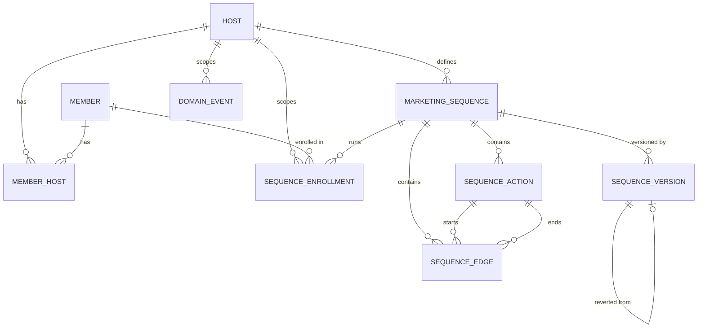

# Data model

First vertical-slice domain: a `Host` (tenant/customer) has `Member`s spanning a
spectrum from lead to fully enrolled, and can define marketing sequences that
automatically act on members over time.

This model is deliberately lean for a PoC. It's informed by the equivalent
domain in Momence's production system (`work/monorepo/view/backend`), adopting
patterns that have proven themselves there while intentionally simplifying or
deferring parts that aren't needed yet. See [Comparison to legacy](#comparison-to-legacy-momence)
below.

## Entities

### Host

The tenant boundary - every tenant-scoped table carries a `hostId` column
directly (no separate abstract "tenant" concept).

| Field       | Type      | Notes                                                                                  |
| ----------- | --------- | -------------------------------------------------------------------------------------- |
| `id`        | uuid      | client-generated (see [Why client-generated UUID ids](#why-client-generated-uuid-ids)) |
| `name`      | string    |                                                                                        |
| `slug`      | string    | unique, used as subdomain/URL identifier                                               |
| `email`     | string    |                                                                                        |
| `timeZone`  | string    |                                                                                        |
| `currency`  | string    |                                                                                        |
| `createdAt` | timestamp |                                                                                        |

### Member

A person's global identity, independent of any host. One `Member` can be
associated with multiple hosts (see [`MemberHost`](#memberhost)) - e.g. the
same person can be a member at two different studios.

| Field         | Type           | Notes |
| ------------- | -------------- | ----- |
| `id`          | uuid           |       |
| `email`       | string         |       |
| `firstName`   | string \| null |       |
| `lastName`    | string \| null |       |
| `phoneNumber` | string \| null |       |
| `createdAt`   | timestamp      |       |

### MemberHost

The junction between a `Member` and a `Host` - this is where the lead ↔
enrolled spectrum actually lives, because it's a property of the
_relationship_ between a person and a specific host, not of the person
globally. The same `Member` can be `enrolled` at one host and a `lead` at
another simultaneously.

| Field         | Type                   | Notes                                                                                                                                                                                                                                                                                  |
| ------------- | ---------------------- | -------------------------------------------------------------------------------------------------------------------------------------------------------------------------------------------------------------------------------------------------------------------------------------- |
| `id`          | uuid                   | own primary key (not a composite key - see [Why client-generated UUID ids](#why-client-generated-uuid-ids))                                                                                                                                                                            |
| `memberId`    | uuid (FK → Member)     |                                                                                                                                                                                                                                                                                        |
| `hostId`      | uuid (FK → Host)       |                                                                                                                                                                                                                                                                                        |
| `status`      | `"lead" \| "enrolled"` |                                                                                                                                                                                                                                                                                        |
| `convertedAt` | timestamp \| null      | when `status` most recently transitioned to `"enrolled"`. Captures the _latest_ transition only - if a member could ever flip `enrolled → lead → enrolled` and the full transition history mattered, that would need to come from `DomainEvent` instead. Decided against that for now. |
| `createdAt`   | timestamp              |                                                                                                                                                                                                                                                                                        |

Unique constraint on `(memberId, hostId)`.

### MarketingSequence

A host-defined automation: on a trigger, run a sequence of actions against
enrolled/lead members.

| Field         | Type             | Notes                                                                                                                                         |
| ------------- | ---------------- | --------------------------------------------------------------------------------------------------------------------------------------------- |
| `id`          | uuid             |                                                                                                                                               |
| `hostId`      | uuid (FK → Host) |                                                                                                                                               |
| `name`        | string           |                                                                                                                                               |
| `triggerType` | string           | validated against a growing Schema union in code, not a native DB enum or lookup table - adding a new trigger type never requires a migration |
| `isEnabled`   | boolean          |                                                                                                                                               |
| `createdAt`   | timestamp        |                                                                                                                                               |

### SequenceAction

One node in a sequence's action graph.

| Field           | Type                                                           | Notes                                                                                                                                                            |
| --------------- | -------------------------------------------------------------- | ---------------------------------------------------------------------------------------------------------------------------------------------------------------- |
| `id`            | uuid                                                           | client-generated - stable across a `SequenceVersion` revert                                                                                                      |
| `sequenceId`    | uuid (FK → MarketingSequence)                                  |                                                                                                                                                                  |
| `type`          | `"EMAIL" \| "SMS" \| "CONDITION" \| "TAG_ADD" \| "TAG_REMOVE"` | small starter set; extensible the same way as `triggerType`                                                                                                      |
| `offsetMinutes` | number                                                         | **absolute** offset from the trigger time, not relative to the previous action - avoids compounding drift and simplifies reordering actions in a flow-builder UI |
| `config`        | jsonb                                                          | shape depends on `type` (e.g. template/subject for `EMAIL`, tag id for `TAG_ADD`)                                                                                |

### SequenceEdge

The DAG structure between actions - explicit adjacency, not a `nextActionId`
pointer on the action itself. This is what lets a `CONDITION` action branch.

| Field             | Type                          | Notes                                                                                         |
| ----------------- | ----------------------------- | --------------------------------------------------------------------------------------------- |
| `id`              | uuid                          |                                                                                               |
| `sequenceId`      | uuid (FK → MarketingSequence) |                                                                                               |
| `fromActionId`    | uuid (FK → SequenceAction)    |                                                                                               |
| `toActionId`      | uuid (FK → SequenceAction)    |                                                                                               |
| `conditionBranch` | `"true" \| "false" \| null`   | `null` = unconditional edge; otherwise which branch of a `CONDITION` action this edge follows |

### SequenceEnrollment

One run of a sequence for one member - i.e. the enrollment record.

| Field         | Type                          | Notes                            |
| ------------- | ----------------------------- | -------------------------------- |
| `id`          | uuid                          |                                  |
| `hostId`      | uuid (FK → Host)              | denormalized, for tenant scoping |
| `sequenceId`  | uuid (FK → MarketingSequence) |                                  |
| `memberId`    | uuid (FK → Member)            |                                  |
| `triggeredAt` | timestamp                     |                                  |
| `finishedAt`  | timestamp \| null             |                                  |
| `cancelledAt` | timestamp \| null             |                                  |

Lifecycle is expressed via these nullable timestamps, not a status enum.
"Current position in the sequence" is not persisted as authoritative state -
it's recomputed from `SequenceAction`/`SequenceEdge` plus these timestamps
whenever the enrollment is advanced, which keeps it tolerant of the sequence
definition changing mid-flight.

### SequenceVersion

A full snapshot of a sequence's definition at a point in time, enabling undo /
revert-to-a-point-in-history (not full event sourcing - see
[Why snapshots, not event sourcing](#why-snapshots-not-event-sourcing)).

| Field                   | Type                                    | Notes                                                                                |
| ----------------------- | --------------------------------------- | ------------------------------------------------------------------------------------ |
| `id`                    | uuid                                    |                                                                                      |
| `sequenceId`            | uuid (FK → MarketingSequence)           |                                                                                      |
| `hostId`                | uuid (FK → Host)                        |                                                                                      |
| `snapshot`              | jsonb                                   | full definition at this point: name, triggerType, isEnabled, actions, edges          |
| `revertedFromVersionId` | uuid \| null (FK → SequenceVersion)     | set when this version was created _as the result of_ reverting to an earlier version |
| `actorType`             | `"host_user" \| "ai_agent" \| "system"` |                                                                                      |
| `actorId`               | uuid \| null                            |                                                                                      |
| `createdAt`             | timestamp                               |                                                                                      |

Reverting means restoring the live `SequenceAction`/`SequenceEdge` rows from
`snapshot` **using the original ids captured in the snapshot** (an upsert
keyed by `id`, not a wipe-and-regenerate-fresh-ids operation) - see
[Why client-generated UUID ids](#why-client-generated-uuid-ids) for why that's
safe. Reverting also writes a _new_ `SequenceVersion` row (with
`revertedFromVersionId` set) rather than just mutating history in place.

### DomainEvent

A generic, append-only audit trail spanning every aggregate in the system -
not per-aggregate audit tables.

| Field           | Type                                    | Notes                                                                                     |
| --------------- | --------------------------------------- | ----------------------------------------------------------------------------------------- |
| `id`            | uuid                                    |                                                                                           |
| `hostId`        | uuid (FK → Host)                        |                                                                                           |
| `aggregateType` | string                                  | e.g. `"Member"`, `"MemberHost"`, `"MarketingSequence"`, `"SequenceEnrollment"`            |
| `aggregateId`   | uuid                                    | polymorphic - references whichever aggregate `aggregateType` names, not a single fixed FK |
| `eventType`     | string                                  | e.g. `"MemberEnrolled"`, `"SequenceActionExecuted"`, `"SequenceReverted"`                 |
| `payload`       | jsonb                                   | shape depends on `eventType`                                                              |
| `actorType`     | `"host_user" \| "ai_agent" \| "system"` | who/what caused this - important for auditing AI-agent-triggered mutations                |
| `actorId`       | uuid \| null                            |                                                                                           |
| `occurredAt`    | timestamp                               |                                                                                           |

## Relationships

## Design decisions

### Why client-generated UUID ids

Every synced table uses a single `id: uuid` primary key generated on the
client, never a database auto-increment integer. This is a hard requirement
from PowerSync (every synced table needs a single `text`-typed primary key
column named `id`, recommended as a client-generated UUID) so that the client
can write optimistically to its local replica before the server confirms
anything - not a stylistic choice.

It also happens to solve stable identity across a `SequenceVersion` revert for
free: restoring a snapshot re-creates rows with their _original_ ids rather
than minting new ones, so anything that referenced an action by id (edges,
idempotency checks when the action actually runs) keeps working across a
revert with no extra "stable key" field needed.

### Why snapshots, not event sourcing

`DomainEvent` records _what happened_, but reconstructing "the full state of a
sequence at time T" by replaying deltas is full event sourcing - which adds
real friction against PowerSync's sync-based architecture (state would need to
exist only as a projection, complicating what actually gets synced). Momence's
own sequence-run engine doesn't do this either: `finishedAt`/`cancelledAt` are
plain columns, not derived by replay.

For the one thing that genuinely needs point-in-time revert (a sequence's
definition), a full-state snapshot per version is simpler than event replay:
revert is "restore this snapshot," not "replay N deltas against a blank
state."

### Why status lives on `MemberHost`, not `Member`

Enrollment status is a property of the relationship between a person and a
specific host, not of the person globally - the same `Member` can be
`enrolled` at one host and a `lead` at another at the same time.

### Why one generic `DomainEvent`, not per-aggregate audit tables

Momence's own system grew three overlapping "customer state machine" concepts
over time (lead pipeline stages, member journeys, campaign sequence runs) that
its own codebase flags as organic growth rather than intentional design. A
single generic event log across all aggregates avoids repeating that.

## Comparison to legacy (Momence)

Legacy reference: `work/monorepo/view/backend/db/entities/` (`Hosts`,
`RibbonMembers`, `RibbonMembersHosts`, `CustomerLeads`,
`HostCampaignSequence*`).

| Aspect                          | Legacy                                                                                                                               | This model                                                                 |
| ------------------------------- | ------------------------------------------------------------------------------------------------------------------------------------ | -------------------------------------------------------------------------- |
| Member identity                 | 4 tables (`RibbonMembers` + `RibbonMembersHosts` + `CustomerLeads` with its own id space + `UserRegistrationRequests` capture layer) | 2 tables (`Member` + `MemberHost` with `status` directly on the junction)  |
| Status                          | none - inferred from row presence/absence and timestamps (`convertedToCustomerAt`, existence of a `BoughtMemberships` row)           | explicit `status: "lead" \| "enrolled"`                                    |
| Trigger types                   | DB lookup table with per-trigger capability flags (`enabledForEmails`, `pickSession`, ...), 48 values                                | plain extensible string, no capability-flag metadata, fewer starter values |
| Action types                    | 14 values (incl. `WHATSAPP`, `HOST_TASK`, `MONEY_CREDITS_ADD`, `MEMBERSHIP_ADD`)                                                     | 5 starter values (`EMAIL`, `SMS`, `CONDITION`, `TAG_ADD`, `TAG_REMOVE`)    |
| Action offset                   | 3 columns (`offsetDays`/`offsetHours`/`offsetMinutes`)                                                                               | 1 column (`offsetMinutes`), same absolute-from-trigger principle           |
| DAG structure                   | separate edges table (`start_action_id`/`end_action_id`/`condition_branch_type`)                                                     | adopted ~1:1 (`SequenceEdge`)                                              |
| Audit/history                   | split across `HostCampaignSequenceRunLogs` (sequence-run-specific) + per-action-type polymorphic result tables                       | one generic `DomainEvent` across all aggregates                            |
| Sequence definition undo/revert | not found in legacy                                                                                                                  | `SequenceVersion` (net-new)                                                |
| AI-agent actor tracking         | not applicable (no AI-agent concept)                                                                                                 | `actorType`/`actorId` on `DomainEvent` and `SequenceVersion` (net-new)     |
| Host entity                     | ~250-relation aggregate covering billing, scheduling, messaging, integrations, etc.                                                  | lean (6 fields); everything else added iteratively as separate concerns    |

## Deferred / out of scope for this PoC

These exist in legacy and are consciously not modeled yet:

- **Per-host customizable lead pipeline stages** (legacy: `CustomerLeadsStages`)
  - we only have binary `lead | enrolled`
- **Generic sequence targeting/filtering** (legacy: `HostFilterSets` /
  `HostFilterRules`) - our `MarketingSequence` has no concept yet of _who_
  should or shouldn't be enrolled beyond the trigger firing
- **Per-action execution result log** (legacy:
  `HostCampaignSequenceRunLogs` + polymorphic per-action-type result tables) -
  `DomainEvent` doesn't yet capture detailed per-action execution results
- **Multi-location / franchise structure** (legacy: `HostLocations`,
  `CorporateHosts`)
