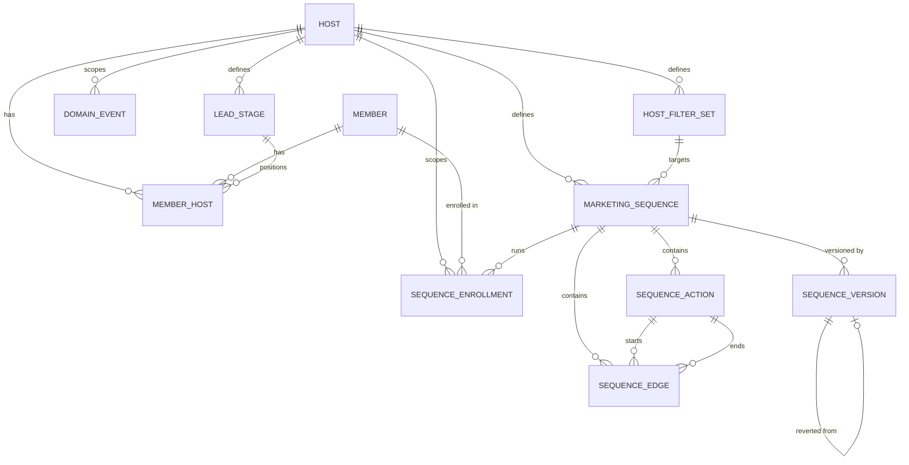

# Data model

First vertical-slice domain: a `Host` (tenant/customer) has `Member`s spanning a
spectrum from lead to fully enrolled, and can define marketing sequences that
automatically act on members over time.

This model is deliberately lean for a PoC. It's informed by the equivalent
domain in Momence's production system (`work/monorepo/view/backend`), adopting
patterns that have proven themselves there while intentionally simplifying or
deferring parts that aren't needed yet. See [Comparison to legacy](#comparison-to-legacy-momence)
below.

## Entities

### Host

The tenant boundary - every tenant-scoped table carries a `hostId` column
directly (no separate abstract "tenant" concept).

| Field          | Type      | Notes                                                                                                                                                                                      |
| -------------- | --------- | ------------------------------------------------------------------------------------------------------------------------------------------------------------------------------------------ |
| `id`           | uuid      | client-generated (see [Why client-generated UUID ids](#why-client-generated-uuid-ids))                                                                                                     |
| `name`         | string    |                                                                                                                                                                                            |
| `slug`         | string    | unique, used as subdomain/URL identifier                                                                                                                                                   |
| `email`        | string    |                                                                                                                                                                                            |
| `timeZone`     | string    |                                                                                                                                                                                            |
| `currency`     | string    |                                                                                                                                                                                            |
| `businessType` | string    | required - e.g. `"gym"`, `"yoga_studio"`, `"martial_arts"`, `"spa"` (extensible, same pattern as `triggerType`); drives `LeadStage` seeding, see [`LeadStageTemplate`](#leadstagetemplate) |
| `createdAt`    | timestamp |                                                                                                                                                                                            |

### Member

A person's global identity, independent of any host. One `Member` can be
associated with multiple hosts (see [`MemberHost`](#memberhost)) - e.g. the
same person can be a member at two different studios.

| Field         | Type           | Notes |
| ------------- | -------------- | ----- |
| `id`          | uuid           |       |
| `email`       | string         |       |
| `firstName`   | string \| null |       |
| `lastName`    | string \| null |       |
| `phoneNumber` | string \| null |       |
| `createdAt`   | timestamp      |       |

### MemberHost

The junction between a `Member` and a `Host` - this is where the lead ↔
enrolled spectrum actually lives, because it's a property of the
_relationship_ between a person and a specific host, not of the person
globally. The same `Member` can be `enrolled` at one host and a `lead` at
another simultaneously.

| Field         | Type                          | Notes                                                                                                                                                                                                                                                                                  |
| ------------- | ----------------------------- | -------------------------------------------------------------------------------------------------------------------------------------------------------------------------------------------------------------------------------------------------------------------------------------- |
| `id`          | uuid                          | own primary key (not a composite key - see [Why client-generated UUID ids](#why-client-generated-uuid-ids))                                                                                                                                                                            |
| `memberId`    | uuid (FK → Member)            |                                                                                                                                                                                                                                                                                        |
| `hostId`      | uuid (FK → Host)              |                                                                                                                                                                                                                                                                                        |
| `status`      | `"lead" \| "enrolled"`        |                                                                                                                                                                                                                                                                                        |
| `convertedAt` | timestamp \| null             | when `status` most recently transitioned to `"enrolled"`. Captures the _latest_ transition only - if a member could ever flip `enrolled → lead → enrolled` and the full transition history mattered, that would need to come from `DomainEvent` instead. Decided against that for now. |
| `leadStageId` | uuid \| null (FK → LeadStage) | CRM pipeline position while `status` is `"lead"`. Independent of `status`: `status` is the binary "converted yet or not", `leadStageId` is "how far along the funnel" - the same split legacy makes between `CustomerLeads.stageId` and `convertedToCustomerAt`.                       |
| `createdAt`   | timestamp                     |                                                                                                                                                                                                                                                                                        |

Unique constraint on `(memberId, hostId)`.

### LeadStageTemplate

Platform-maintained reference data, not tenant-editable - the default set of
CRM pipeline stages for a given `businessType`. Different business types need
meaningfully different default funnels (a gym's lead process looks nothing
like a spa's), so this isn't one fixed list.

| Field          | Type           | Notes                       |
| -------------- | -------------- | --------------------------- |
| `id`           | uuid           |                             |
| `businessType` | string         | matches `Host.businessType` |
| `name`         | string         |                             |
| `color`        | string \| null |                             |
| `order`        | number         |                             |

### LeadStage

A host's actual, editable CRM pipeline stages - seeded (copied, not
live-referenced) from the matching `LeadStageTemplate` rows when the host is
created, then fully owned by the host from that point on. Renaming, reordering,
recoloring, adding, or removing a host's stages never touches
`LeadStageTemplate` or any other host.

| Field       | Type             | Notes |
| ----------- | ---------------- | ----- |
| `id`        | uuid             |       |
| `hostId`    | uuid (FK → Host) |       |
| `name`      | string           |       |
| `color`     | string \| null   |       |
| `order`     | number           |       |
| `createdAt` | timestamp        |       |

### MarketingSequence

A host-defined automation: on a trigger, run a sequence of actions against
enrolled/lead members.

| Field         | Type                              | Notes                                                                                                                                         |
| ------------- | --------------------------------- | --------------------------------------------------------------------------------------------------------------------------------------------- |
| `id`          | uuid                              |                                                                                                                                               |
| `hostId`      | uuid (FK → Host)                  |                                                                                                                                               |
| `name`        | string                            |                                                                                                                                               |
| `triggerType` | string                            | validated against a growing Schema union in code, not a native DB enum or lookup table - adding a new trigger type never requires a migration |
| `filterSetId` | uuid \| null (FK → HostFilterSet) | who this sequence targets beyond "the trigger fired" - `null` means everyone the trigger fires for                                            |
| `isEnabled`   | boolean                           |                                                                                                                                               |
| `createdAt`   | timestamp                         |                                                                                                                                               |

### HostFilterSet

A named, reusable set of targeting rules for a host - replaces having one
one-off nullable FK column per targeting dimension on `MarketingSequence`
(the kind of thing legacy started with and later refactored away from - see
[Comparison to legacy](#comparison-to-legacy-momence)).

| Field       | Type             | Notes                           |
| ----------- | ---------------- | ------------------------------- |
| `id`        | uuid             |                                 |
| `hostId`    | uuid (FK → Host) |                                 |
| `name`      | string           |                                 |
| `rules`     | jsonb            | a `FilterRule` tree - see below |
| `createdAt` | timestamp        |                                 |

`rules` is a recursive expression tree, not normalized rule rows - boolean
`AND`/`OR`/`NOT` nesting maps awkwardly onto relational rows, and legacy
itself stores its equivalent (`counterConditions`) as jsonb rather than a rule
table:

```
FilterRule =
  | { type: "condition", field: string, operator: FilterOperator, value: unknown }
  | { type: "group", combinator: "and" | "or", rules: FilterRule[] }

FilterOperator =
  | "equals" | "not_equals" | "contains"
  | "gt" | "gte" | "lt" | "lte"
  | "in" | "not_in"
```

`field` is an extensible string (grows the same way as `triggerType` and
`SequenceAction.type`, no migration needed to add a new targetable field).
`operator` is a fixed union - comparison operators are stable enough not to
need the same growability.

### SequenceAction

One node in a sequence's action graph.

| Field           | Type                                                           | Notes                                                                                                                                                            |
| --------------- | -------------------------------------------------------------- | ---------------------------------------------------------------------------------------------------------------------------------------------------------------- |
| `id`            | uuid                                                           | client-generated - stable across a `SequenceVersion` revert                                                                                                      |
| `sequenceId`    | uuid (FK → MarketingSequence)                                  |                                                                                                                                                                  |
| `type`          | `"EMAIL" \| "SMS" \| "CONDITION" \| "TAG_ADD" \| "TAG_REMOVE"` | small starter set; extensible the same way as `triggerType`                                                                                                      |
| `offsetMinutes` | number                                                         | **absolute** offset from the trigger time, not relative to the previous action - avoids compounding drift and simplifies reordering actions in a flow-builder UI |
| `config`        | jsonb                                                          | shape depends on `type` (e.g. template/subject for `EMAIL`, tag id for `TAG_ADD`)                                                                                |

### SequenceEdge

The DAG structure between actions - explicit adjacency, not a `nextActionId`
pointer on the action itself. This is what lets a `CONDITION` action branch.

| Field             | Type                          | Notes                                                                                         |
| ----------------- | ----------------------------- | --------------------------------------------------------------------------------------------- |
| `id`              | uuid                          |                                                                                               |
| `sequenceId`      | uuid (FK → MarketingSequence) |                                                                                               |
| `fromActionId`    | uuid (FK → SequenceAction)    |                                                                                               |
| `toActionId`      | uuid (FK → SequenceAction)    |                                                                                               |
| `conditionBranch` | `"true" \| "false" \| null`   | `null` = unconditional edge; otherwise which branch of a `CONDITION` action this edge follows |

### SequenceEnrollment

One run of a sequence for one member - i.e. the enrollment record.

| Field         | Type                          | Notes                            |
| ------------- | ----------------------------- | -------------------------------- |
| `id`          | uuid                          |                                  |
| `hostId`      | uuid (FK → Host)              | denormalized, for tenant scoping |
| `sequenceId`  | uuid (FK → MarketingSequence) |                                  |
| `memberId`    | uuid (FK → Member)            |                                  |
| `triggeredAt` | timestamp                     |                                  |
| `finishedAt`  | timestamp \| null             |                                  |
| `cancelledAt` | timestamp \| null             |                                  |

Lifecycle is expressed via these nullable timestamps, not a status enum.
"Current position in the sequence" is not persisted as authoritative state -
it's recomputed from `SequenceAction`/`SequenceEdge` plus these timestamps
whenever the enrollment is advanced, which keeps it tolerant of the sequence
definition changing mid-flight.

### SequenceVersion

A full snapshot of a sequence's definition at a point in time, enabling undo /
revert-to-a-point-in-history (not full event sourcing - see
[Why snapshots, not event sourcing](#why-snapshots-not-event-sourcing)).

| Field                   | Type                                    | Notes                                                                                |
| ----------------------- | --------------------------------------- | ------------------------------------------------------------------------------------ |
| `id`                    | uuid                                    |                                                                                      |
| `sequenceId`            | uuid (FK → MarketingSequence)           |                                                                                      |
| `hostId`                | uuid (FK → Host)                        |                                                                                      |
| `snapshot`              | jsonb                                   | full definition at this point: name, triggerType, isEnabled, actions, edges          |
| `revertedFromVersionId` | uuid \| null (FK → SequenceVersion)     | set when this version was created _as the result of_ reverting to an earlier version |
| `actorType`             | `"host_user" \| "ai_agent" \| "system"` |                                                                                      |
| `actorId`               | uuid \| null                            |                                                                                      |
| `createdAt`             | timestamp                               |                                                                                      |

Reverting means restoring the live `SequenceAction`/`SequenceEdge` rows from
`snapshot` **using the original ids captured in the snapshot** (an upsert
keyed by `id`, not a wipe-and-regenerate-fresh-ids operation) - see
[Why client-generated UUID ids](#why-client-generated-uuid-ids) for why that's
safe. Reverting also writes a _new_ `SequenceVersion` row (with
`revertedFromVersionId` set) rather than just mutating history in place.

### DomainEvent

A generic, append-only audit trail spanning every aggregate in the system -
not per-aggregate audit tables.

| Field           | Type                                    | Notes                                                                                     |
| --------------- | --------------------------------------- | ----------------------------------------------------------------------------------------- |
| `id`            | uuid                                    |                                                                                           |
| `hostId`        | uuid (FK → Host)                        |                                                                                           |
| `aggregateType` | string                                  | e.g. `"Member"`, `"MemberHost"`, `"MarketingSequence"`, `"SequenceEnrollment"`            |
| `aggregateId`   | uuid                                    | polymorphic - references whichever aggregate `aggregateType` names, not a single fixed FK |
| `eventType`     | string                                  | e.g. `"MemberEnrolled"`, `"SequenceActionExecuted"`, `"SequenceReverted"`                 |
| `payload`       | jsonb                                   | shape depends on `eventType`                                                              |
| `actorType`     | `"host_user" \| "ai_agent" \| "system"` | who/what caused this - important for auditing AI-agent-triggered mutations                |
| `actorId`       | uuid \| null                            |                                                                                           |
| `occurredAt`    | timestamp                               |                                                                                           |

`payload` also covers detailed per-action execution results (legacy's
`HostCampaignSequenceRunLogs` + a separate polymorphic result table per action
type) - no extra tables needed, just a per-`eventType` payload shape, the same
pattern `SequenceAction.config` already uses for `type`:

```
eventType: "SequenceActionExecuted"
aggregateType: "SequenceEnrollment"
aggregateId: <enrollmentId>
payload: {
  actionId: uuid
  actionType: "EMAIL" | "SMS" | "CONDITION" | "TAG_ADD" | "TAG_REMOVE"
  result:
    // discriminated union depending on actionType
    | { actionType: "EMAIL" | "SMS", messageId: string, sentAt: timestamp, provider: string }
    | { actionType: "CONDITION", branchTaken: "true" | "false" }
    | { actionType: "TAG_ADD" | "TAG_REMOVE", tagId: uuid }
}
```

## Relationships



## Design decisions

### Why client-generated UUID ids

Every synced table uses a single `id: uuid` primary key generated on the
client, never a database auto-increment integer. This is a hard requirement
from PowerSync (every synced table needs a single `text`-typed primary key
column named `id`, recommended as a client-generated UUID) so that the client
can write optimistically to its local replica before the server confirms
anything - not a stylistic choice.

It also happens to solve stable identity across a `SequenceVersion` revert for
free: restoring a snapshot re-creates rows with their _original_ ids rather
than minting new ones, so anything that referenced an action by id (edges,
idempotency checks when the action actually runs) keeps working across a
revert with no extra "stable key" field needed.

### Why snapshots, not event sourcing

`DomainEvent` records _what happened_, but reconstructing "the full state of a
sequence at time T" by replaying deltas is full event sourcing - which adds
real friction against PowerSync's sync-based architecture (state would need to
exist only as a projection, complicating what actually gets synced). Momence's
own sequence-run engine doesn't do this either: `finishedAt`/`cancelledAt` are
plain columns, not derived by replay.

For the one thing that genuinely needs point-in-time revert (a sequence's
definition), a full-state snapshot per version is simpler than event replay:
revert is "restore this snapshot," not "replay N deltas against a blank
state."

### Why status lives on `MemberHost`, not `Member`

Enrollment status is a property of the relationship between a person and a
specific host, not of the person globally - the same `Member` can be
`enrolled` at one host and a `lead` at another at the same time.

### Why one generic `DomainEvent`, not per-aggregate audit tables

Momence's own system grew three overlapping "customer state machine" concepts
over time (lead pipeline stages, member journeys, campaign sequence runs) that
its own codebase flags as organic growth rather than intentional design. A
single generic event log across all aggregates avoids repeating that.

## Comparison to legacy (Momence)

Legacy reference: `work/monorepo/view/backend/db/entities/` (`Hosts`,
`RibbonMembers`, `RibbonMembersHosts`, `CustomerLeads`,
`HostCampaignSequence*`).

| Aspect                          | Legacy                                                                                                                               | This model                                                                                                                                                       |
| ------------------------------- | ------------------------------------------------------------------------------------------------------------------------------------ | ---------------------------------------------------------------------------------------------------------------------------------------------------------------- |
| Member identity                 | 4 tables (`RibbonMembers` + `RibbonMembersHosts` + `CustomerLeads` with its own id space + `UserRegistrationRequests` capture layer) | 2 tables (`Member` + `MemberHost` with `status` directly on the junction)                                                                                        |
| Status                          | none - inferred from row presence/absence and timestamps (`convertedToCustomerAt`, existence of a `BoughtMemberships` row)           | explicit `status: "lead" \| "enrolled"`                                                                                                                          |
| Trigger types                   | DB lookup table with per-trigger capability flags (`enabledForEmails`, `pickSession`, ...), 48 values                                | plain extensible string, no capability-flag metadata, fewer starter values                                                                                       |
| Action types                    | 14 values (incl. `WHATSAPP`, `HOST_TASK`, `MONEY_CREDITS_ADD`, `MEMBERSHIP_ADD`)                                                     | 5 starter values (`EMAIL`, `SMS`, `CONDITION`, `TAG_ADD`, `TAG_REMOVE`)                                                                                          |
| Action offset                   | 3 columns (`offsetDays`/`offsetHours`/`offsetMinutes`)                                                                               | 1 column (`offsetMinutes`), same absolute-from-trigger principle                                                                                                 |
| DAG structure                   | separate edges table (`start_action_id`/`end_action_id`/`condition_branch_type`)                                                     | adopted ~1:1 (`SequenceEdge`)                                                                                                                                    |
| Audit/history                   | split across `HostCampaignSequenceRunLogs` (sequence-run-specific) + per-action-type polymorphic result tables                       | one generic `DomainEvent` across all aggregates, incl. per-action execution results via `payload`                                                                |
| Sequence definition undo/revert | not found in legacy                                                                                                                  | `SequenceVersion` (net-new)                                                                                                                                      |
| AI-agent actor tracking         | not applicable (no AI-agent concept)                                                                                                 | `actorType`/`actorId` on `DomainEvent` and `SequenceVersion` (net-new)                                                                                           |
| Sequence targeting              | one `hostFilterSetId` FK + jsonb `counterConditions` (after refactoring away from ~15 one-off FK columns)                            | `HostFilterSet` + jsonb `rules` tree (adopted ~1:1)                                                                                                              |
| Lead pipeline stages            | `CustomerLeadsStages` - per-host only, freely defined from a blank slate, no business-type templating found                          | `LeadStageTemplate` (per `businessType`, platform-maintained) seeds `LeadStage` (per-host, then freely editable) - net-new templating layer, not found in legacy |
| Host entity                     | ~250-relation aggregate covering billing, scheduling, messaging, integrations, etc.                                                  | lean (7 fields); everything else added iteratively as separate concerns                                                                                          |

### Effect Schema → Drizzle bridge

Built as `packages/db`: hand-written Drizzle table definitions (Postgres, via
`drizzle-orm`/`drizzle-kit`) alongside the Effect Schema entities in
`packages/schema`, plus a drift test (`packages/db/src/drift.test.ts`) that
compares each Drizzle table's column-name set against its corresponding Effect
Schema's field-name set, failing if they diverge.

Rejected alternative: codegen instead of a drift test. Drizzle does ship an
Effect Schema bridge (`drizzle-orm/effect-schema`'s `createInsertSchema`/
`createUpdateSchema`/`createSelectSchema`, generating Effect Schema validators
from a Drizzle table - genuinely targets Effect v4, not a stale v3 tool), but
two things rule it out here: it only exists on Drizzle's `1.0.0-rc.*` line, not
the `0.45.x` stable release this repo pins, and it generates in the opposite
direction from what we need - DB table to per-operation validator, not our
domain-model-is-the-source-of-truth direction. It also wouldn't replace
`packages/schema`'s branded ids or discriminated unions (`SequenceAction`,
`FilterRule`), only auto-derive raw CRUD-shaped validators from the DB row
shape. Worth revisiting once Drizzle v1 is stable, as a way to generate
`apps/server`'s raw insert/update/select validators - not as a replacement for
this drift test or for `packages/schema` itself.

`id`/foreign-key columns are `text`, not Postgres's native `uuid` type - same
PowerSync requirement as the `id` column itself (see "Why client-generated UUID
ids" above). `SequenceAction` is one flat table in Postgres even though
`packages/schema` models it as a discriminated union in TypeScript - `config`'s
shape depends on `type` at the application layer, not the DB layer, so the
drift test reads its field set from any one of the union's cases (they all
share the same top-level keys).

### Postgres RLS for multi-tenancy

Every host-scoped table in `packages/db`'s schema has `.enableRLS()` plus a
`pgPolicy` (see `packages/db/src/rls.ts` for the two shared policy builders):

- **Direct `host_id` column** (`hosts` itself via `id`, `host_filter_sets`,
  `lead_stages`, `marketing_sequences`, `member_hosts`, `sequence_enrollments`,
  `sequence_versions`, `domain_events`) - `hostIsolationPolicy(column)`, a
  simple `column = current_setting('app.host_id', true)` check.
- **Scoped only via a join** (`members` via `member_hosts`,
  `sequence_actions`/`sequence_edges` via `marketing_sequences`) -
  `hostIsolationViaJoinPolicy(...)`, an `exists (select 1 from <join table>
where ...)` check. References the other table by literal SQL name rather
  than importing its Drizzle table object, to avoid circular imports between
  schema files (e.g. `MemberHost.ts` already imports `members`).
- **`lead_stage_templates` deliberately has no RLS** - it's platform-maintained
  reference data, not scoped to any host.

Every policy uses `for: "all"` with the same expression in both `using` and
`withCheck`, so it applies uniformly to reads and writes.

**The session variable a policy checks must actually get set, and the
connecting role must actually be subject to RLS** - two gaps that would make
enabling RLS pure theater if left unaddressed:

- Postgres lets the table **owner** bypass RLS by default (`FORCE ROW LEVEL
SECURITY` would override this, but this repo takes the other approach:
  `postgres/init-scripts/02-app-user-role.sql` creates a separate non-owner,
  non-superuser `app_user` role with `SELECT`/`INSERT`/`UPDATE`/`DELETE`
  grants only. `effective_app` (the `DATABASE_URL` role) still owns every
  table via drizzle-kit migrations and bypasses RLS entirely - it must never
  be used for request-time queries. `apps/server` connects via a separate
  `APP_DATABASE_URL`, as `app_user`.
- `apps/server/src/HostScopedDb.ts` is the only way `apps/server`'s handlers
  touch the database: `query(fn)` opens a Drizzle transaction, runs
  `select set_config('app.host_id', $1, true)` (parameterized, transaction-
  local) using the current request's verified `CurrentHost.hostId`, then runs
  `fn` inside that same transaction. There's no other entry point to
  `Db` exposed to handlers, so a handler can't accidentally issue a
  host-scoped query without that context set.

**Verified end-to-end** (2026-07-16): as the `app_user` role directly via
`psql`, with two seeded hosts, `set_config('app.host_id', '<host A>', true)`
returns only host A's row (and only host A's `members`, via the join policy),
switching to host B's id returns only host B's, and with no `app.host_id` set
at all the query returns zero rows (fail-closed, not fail-open). The same
proof was repeated one level up, through `apps/server`'s real `GET /hosts/me`
endpoint (see "Auth: Keycloak + apps/server" below) - a password-grant token
for the seeded test user returns exactly that user's own host row, with no
`WHERE` clause needed in the handler at all; RLS is what's actually filtering.

### Auth: Keycloak + apps/server

Self-hosted Keycloak (`docker-compose.yml`'s `keycloak` service, dev-mode
`start-dev --import-realm`) is the identity provider; `apps/server` never
talks to it directly - business logic depends only on `AuthService`
(`apps/server/src/JwtVerifier.ts`/`Auth.ts`), a swappable `Layer` per
`AGENTS.md`'s auth rule, so Keycloak could be swapped for another OIDC
provider without touching domain code. Realm/client/test-user config lives in
`keycloak/realm-export.json`, imported automatically on first start - no
manual admin-console clicking needed to reproduce this setup.

`host_id` reaches the JWT via a Keycloak user-attribute protocol mapper
(`oidc-usermodel-attribute-mapper`) mapping the user's `host_id` attribute to
a `host_id` claim. Two gotchas hit while wiring this up, both easy to hit
again if this config is hand-edited later:

- **Keycloak 24+ ignores custom user attributes by default** ("unmanaged
  attributes" are disabled unless the realm's declarative user profile
  explicitly declares them) - `host_id` had to be added to the realm's user
  profile config (`components` → `org.keycloak.userprofile.UserProfileProvider`
  in `keycloak/realm-export.json`) before the attribute would even persist on
  import, let alone reach a token.
- **The mapper's config key is `user.attribute`, not `userAttribute`** -
  the latter is what the analogous OID4VC mapper uses, easy to confuse, and
  Keycloak silently accepts the wrong key (no validation error) while just
  never populating the claim. Confirmed the correct key via the running
  instance's own `/admin/serverinfo` endpoint, which lists every protocol
  mapper's real config property names.

A second mapper (`oidc-audience-mapper`, `included.custom.audience:
powersync-dev`) adds `powersync-dev` to the token's `aud` claim - this is
what lets the exact same Keycloak-issued token satisfy both `apps/server`'s
`AuthService` and PowerSync's `client_auth` (see below), rather than needing
two different tokens for the two consumers.

`apps/server` (`effect/unstable/httpapi`) has a public `/health` endpoint, a
protected `/me` endpoint, and a protected `/hosts/me` endpoint (which actually
queries Postgres through `HostScopedDb` - see "Postgres RLS for
multi-tenancy" above) - all behind an `Auth` `HttpApiMiddleware.Service` using
`HttpApiSecurity.bearer` - which only extracts the raw credential, the actual
verification is `JwtVerifier`, backed by `jose`'s `createRemoteJWKSet` against
Keycloak's realm JWKS endpoint. `JwtVerifier` is itself swappable (`layer` for
the real remote JWKS, `layerWithJwks` for tests using an in-memory JWK set),
so `AuthService.test.ts`-style unit tests never make a real network call, per
`AGENTS.md`'s "external I/O goes through swappable services" rule.

**Verified end-to-end** (2026-07-16): a password-grant token from Keycloak's
test user (`test-host-owner`, `host_id` attribute set to a fixed test UUID)
correctly returns `401` from `/me` with no token, and with the token returns
`200` with the exact `hostId`/`subject` from the JWT claims. The identical
token was then POSTed to PowerSync's `/sync/stream` and accepted, with the
returned checkpoint's `host_data` bucket correctly scoped to that same
`host_id` - confirming the audience mapper and `client_auth.jwks_uri` wiring
in `powersync/service.yaml` (see below) actually works against a real token,
not just against the hand-signed HS256 dev tokens used before Keycloak existed.

A non-obvious Effect `HttpApi` gotcha hit while wiring `/hosts/me`'s
`HostScopedDb` dependency, worth knowing before adding another per-handler
service dependency: a handler's own service requirements (as opposed to ones
a group's `.middleware(...)` already provides, like `CurrentHost`) surface on
`HttpApiBuilder.group(...)`'s layer as a specially-branded
`HttpRouter.Request<"Requires", _>` type, not the plain service tag. Providing
a normal `Layer.provide(HostScopedDbLayer)` _before_ `HttpRouter.serve` in
`main.ts`'s pipe silently fails to satisfy it (they're structurally different
types, so it just stays unresolved) - it only collapses to the plain tag
_after_ `HttpRouter.serve` runs, which is where `HostScopedDbLayer` actually
needs to be provided (see `main.ts`).

### PowerSync sync streams

Self-hosted PowerSync (not PowerSync Cloud - consistent with this repo's "no
cloud account needed for local dev" approach) runs via `docker-compose.yml`'s
`powersync`/`pg-storage` services, config in `powersync/service.yaml` and
`powersync/sync-config.yaml`. Scaffolded with the official `powersync` CLI
(`npx powersync init self-hosted` + `powersync docker configure --database
postgres --storage postgres`) rather than hand-assembled, to match the
tool's own tested defaults - notably, PowerSync's bucket/checkpoint metadata
store (`pg-storage`) is a **separate** Postgres instance from the replication
source (the existing `postgres` service, i.e. our actual app data), not a
schema on the same one.

Sync rules are written as **Sync Streams** (`config: { edition: 3 }` in
`sync-config.yaml`), not the legacy `bucket_definitions` format - Streams are
PowerSync's current recommended approach for new projects, and their expanded
SQL support (real `JOIN`s) is what lets `host_data`'s queries reach `members`
(via `member_hosts`) and `sequence_actions`/`sequence_edges` (via
`marketing_sequences`) without denormalizing `hostId` onto those tables just
for sync purposes.

The `postgres` service's `powersync` publication
(`postgres/init-scripts/01-powersync-publication.sql`) is `FOR ALL TABLES`,
created by `effective_app` (table ownership is required for `CREATE
PUBLICATION`). The **replication connection** itself, though, uses a separate
least-privilege `powersync_replication` role
(`postgres/init-scripts/03-powersync-replication-role.sql`) - `REPLICATION` +
read-only grants, never the `effective_app` superuser. Verified end-to-end
(2026-07-16): after switching `PS_DATA_SOURCE_URI` to this role and
recreating the `powersync` container, it reattached to the existing
replication slot ("Initial replication already done") and a subsequent
`INSERT INTO hosts` still replicated within seconds, confirming `SELECT`-only
access is sufficient for ongoing logical replication.

**Verified working** (2026-07-16, against a real local Docker stack - the
sandbox this was originally built in had Docker Hub pulls blocked, but the
setup was later confirmed on a real machine): `pnpm run dev:infra` brings up
all four services healthy, the `powersync` publication is created, an
`INSERT INTO hosts` shows up in `docker logs` within milliseconds as
`Replicating "public"."hosts" ...` / `Flushed 1 + 0 + 1 updates`. Two real
bugs were caught and fixed in the process, both worth knowing about since
they'll resurface on a fresh machine otherwise:

- **`postgres:18+`'s data directory layout changed** - the image now expects
  its volume mounted at `/var/lib/postgresql` (a parent directory it manages
  itself), not `/var/lib/postgresql/data` directly (the old convention);
  mounting at the old path made `postgres` fail its healthcheck outright on
  a fresh init. Fixed in `docker-compose.yml`'s `postgres` and `pg-storage`
  volume mounts. An existing volume created before this fix has data laid
  out for the old path and needs to be reinitialized once: `pnpm run
dev:infra:down && docker volume rm effective-app_postgres-data
effective-app_powersync-storage-data`.
- **`sslmode` defaults to `verify-full`** on PowerSync's Postgres connections
  (both `replication.connections` and `storage`) - our local Postgres
  containers have no TLS configured, so the client's SSL negotiation was
  failing the connection outright. Surfaced as a generic, unhelpful `"Fatal
startup error ... postgres query failed"` at the wire-protocol level (not a
  SQL error - confirmed by extracting and running the exact failing query,
  `CREATE TABLE IF NOT EXISTS locks (...)`, directly via `psql`, which
  succeeded fine). Fixed by adding `sslmode: disable` to both connections in
  `powersync/service.yaml` - local/private-network only, per PowerSync's own
  docs on that setting.

#### Verifying this works

1. **Apply the Drizzle migration first.** `sync-config.yaml` references real
   table names (`hosts`, `member_hosts`, ...) - they need to exist in Postgres
   before PowerSync can replicate them, so run `packages/db`'s
   `db:generate`/`db:migrate` (see "Effect Schema → Drizzle bridge" above)
   before starting PowerSync for the first time.
2. **Start the stack and check health.**
   ```sh
   pnpm run dev:infra
   docker compose ps                    # postgres, pg-storage, powersync all healthy
   docker compose logs powersync        # look for replication/connection errors
   docker exec -it effective-app-postgres-1 \
     psql -U effective_app -c "select * from pg_publication;"  # expect a `powersync` row
   ```
3. **Insert a row and watch it replicate** - the fastest concrete proof,
   no client SDK needed:
   ```sh
   docker exec -it effective-app-postgres-1 psql -U effective_app -d effective_app -c "
     INSERT INTO hosts (id, name, slug, email, time_zone, currency, business_type, created_at)
     VALUES ('11111111-1111-4111-8111-111111111111', 'Test', 'test', 'a@b.test', 'UTC', 'USD', 'gym', now());
   "
   docker compose logs powersync --tail 10  # expect "Replicating \"public\".\"hosts\" ..."
   ```
4. **Get a real token from Keycloak** for the seeded test user (see "Auth:
   Keycloak + apps/server" above) via the password grant:
   ```sh
   curl -X POST http://localhost:${KEYCLOAK_PORT:-8180}/realms/effective-app/protocol/openid-connect/token \
     -d "grant_type=password" -d "client_id=effective-app-client" \
     -d "username=test-host-owner" -d "password=local_dev_only"
   ```
   The `access_token` in the response carries both the `host_id` claim and the
   `powersync-dev` audience - the same token works against both `apps/server`
   and PowerSync below.
5. **Confirm `apps/server` accepts it**:
   ```sh
   curl http://localhost:4000/me                                   # 401, no token
   curl -H "Authorization: Bearer <access_token>" http://localhost:4000/me
   # 200 {"hostId":"<the test user's host_id attribute>","subject":"<sub>"}
   ```
6. **Confirm PowerSync accepts the same token**, scoped to that `host_id`:
   ```sh
   curl -X POST http://localhost:8080/sync/stream \
     -H "Authorization: Bearer <access_token>" -H "Content-Type: application/json" \
     -d '{"include_checksum": true}'
   # the host_data bucket's key includes the token's host_id, e.g.:
   # "bucket":"1#host_data|0[\"<host_id>\"]"
   ```
7. **The full end-to-end proof** - a real client syncing to local SQLite and
   seeing row changes - needed the client SDK wired into `apps/client`; done as
   a follow-on task, see "apps/client: Keycloak login + PowerSync client"
   below.

### apps/client: Keycloak login + PowerSync client

Closes the loop from the previous sections: a real browser login against
Keycloak, and a real PowerSync client syncing to local SQLite with writes
flowing back through a new `apps/server` endpoint to Postgres.

**Auth** (`apps/client/src/lib/auth.ts`): `oidc-client-ts`'s `UserManager`,
Authorization Code + PKCE against the same `effective-app-client` Keycloak
client `apps/server` uses for password-grant testing (`standardFlowEnabled`,
public client - PKCE is automatic since no `client_secret` is configured).
Token storage is in-memory only (`InMemoryWebStorage`), never
`sessionStorage`/`localStorage` - the OWASP-recommended pattern for SPAs, so
an XSS payload can't exfiltrate a token from storage after the fact. The
tradeoff is that a hard page reload loses the in-memory session;
`silent-renew.html` (a second Vite HTML entry point, not a route - see
`vite.config.ts`'s `build.rollupOptions.input`) recovers it via a hidden
iframe (`signinSilent()`, `prompt=none`) against Keycloak's own SSO session
cookie. A pathless TanStack Router layout route
(`apps/client/src/routes/_authenticated.tsx`) guards every data route,
redirecting to `/login` only if both the in-memory user and the silent
sign-in come back empty.

**PowerSync client schema** (`apps/client/src/lib/powersync/schema.ts`):
hand-written, mirroring this doc's "Effect Schema -> Drizzle bridge" pattern
rather than generated - 12 tables (the 11 write-capable entities plus
read-only `lead_stage_templates`), a compile-time drift check
(`schema.drift.test.ts`) against `@effective-app/schema`'s field names, same
spirit as `packages/db/src/drift.test.ts`. Table names match `packages/db`'s
Postgres table names exactly (snake_case), so a `CrudEntry.table` lines up
1:1 with the server-side write allowlist below.

**Upload endpoint** (`POST /sync/upload`, `apps/server/src/SyncHandlers.ts` +
`SyncEntities.ts`): the first `apps/server` endpoint that writes, not just
reads. A table allowlist (deliberately excluding `lead_stage_templates` -
platform-maintained reference data, not tenant-editable) maps each PowerSync
table name to its Drizzle table and `@effective-app/schema` entity; each
op's `opData` decodes through that Effect Schema before reaching Drizzle,
reusing the same source of truth the drift tests check against rather than
hand-writing per-table validation. Every op runs through the existing
`HostScopedDb.query` (RLS-scoped, same as every other handler), but each op
gets its **own** transaction rather than sharing one across the batch -
Postgres aborts an entire transaction on the first error, which would make
one bad op silently fail every op after it. Per the PowerSync upload
contract (`references/custom-backend.md`), this endpoint always returns 2xx;
per-op failures surface in the response body's `errors` array instead of an
HTTP error status, since a 4xx would block the client's upload queue
permanently.

**CORS**: `effect/unstable/http`'s `HttpRouter.cors` (no CORS module existed
in this repo's vendored Effect v4 before now), allowlisting `CLIENT_ORIGIN`
(`http://localhost:5173`). Needed to be provided to `main.ts`'s `ApiLive`
pipe _before_ `HttpRouter.serve`, unlike `HostScopedDbLayer` - CORS is global
router middleware that needs the `HttpRouter` service itself to register
against, available while routes are still being built, not after `serve` has
already collapsed that requirement.

**Home page UX (`_authenticated.index.tsx`)** - two refinements made after
the first working version, both informed by how PowerSync's reactivity
actually behaves rather than assumptions:

- _Offline shouldn't affect reads, only a stuck write should surface an
  error._ The first version disabled the rename input whenever
  `useStatus().connected` was `false` - but `connected` reflects the
  PowerSync service's _download_ stream, not whether a write can reach
  `apps/server` (the actual upload path), and disabling on mere
  disconnection contradicts the local-first premise (edits should always be
  possible; only a write that's been stuck unsynced for a while is worth
  interrupting the user about). Fixed by reactively watching PowerSync's own
  internal `ps_crud` upload-queue table (`SELECT COUNT(*) AS row_count FROM
ps_crud` - the documented pattern in PowerSync's Production Readiness
  Guide) instead of `useStatus()`, and only escalating to a visible
  "Failed to save changes" + retry button after the queue has stayed
  non-empty for 30 seconds - a brief blip or a slow-but-working retry
  shouldn't alarm the user. "Retry" forces a fresh `disconnect()`/`connect()`
  cycle since `AbstractPowerSyncDatabase` has no public "upload now" API to
  call instead (checked its surface directly).
- _Old-value flicker on blur._ The first version reset the optimistic
  `draftName` input state as soon as `db.execute()`'s promise resolved, then
  relied on the `hosts` query to already reflect the new value. It doesn't:
  `useQuery`'s watched-query re-run is throttled (`DEFAULT_WATCH_THROTTLE_MS
= 30`, in `@powersync/common`'s `WatchedQuery` module - confirmed directly
  in the installed package source, since neither the PowerSync docs nor the
  skill state the exact default), so there's a real gap between the local
  write completing and the query reflecting it, during which the old value
  flashed. Fixed by only clearing `draftName` once the watched query's value
  actually equals what was written, so the input always shows either the
  optimistic value or the confirmed one - never a stale one in between.

**Verified end-to-end** (2026-07-17): logged in through the real browser
flow (Authorization Code + PKCE redirect to Keycloak, back to
`localhost:5173`) as the seeded `test-host-owner` user; the host's real name
rendered, synced from Postgres through PowerSync into local SQLite with no
manual query. Renaming the host in the UI queued a local write, uploaded
through `POST /sync/upload`, and landed in Postgres - confirmed via `psql`
directly, with RLS still scoping the write (no `WHERE` clause in the
handler), and with no old-value flicker on blur (sampled the input's DOM
value every 5-10ms across two separate real writes - a single stable value
throughout, per the fix above). A direct `UPDATE hosts ...` via `psql`
appeared in the browser without a page reload (PowerSync stream push).
Reloading the page restored the session silently via `signinSilent()`
(in-memory token survives a reload without ever being persisted). Stopping
`apps/server` (the actual upload path - independent of PowerSync's own
sync-stream availability) queued a write locally without touching Postgres
and without disabling the input; after the 30s grace period the "Failed to
save changes" + retry banner appeared as designed, and the write flushed
automatically once `apps/server` came back (PowerSync's own retry, before
"Try again" was even clicked) - confirming "reads work offline, mutations
need connectivity" end-to-end, not just the connector wiring.

## Deferred / out of scope for this PoC

These exist in legacy and are consciously not modeled yet:

- **Multi-location / franchise structure** (legacy: `HostLocations`,
  `CorporateHosts`)
